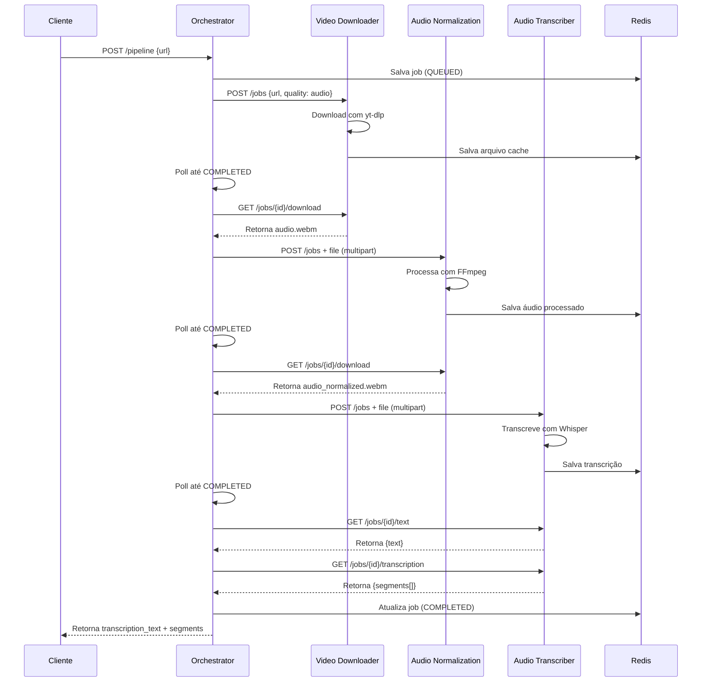

# YTCaption - Easy YouTube API# YTCaption - Easy YouTube API


**Sistema de transcrição automática de vídeos do YouTube** com arquitetura de microserviços escalável e resiliente.Sistema de microserviços para download de vídeos, normalização de áudio e transcrição automática.


## 🎯 Visão Geral## 🚀 Serviços


O YTCaption é uma plataforma completa para processar vídeos do YouTube através de um pipeline automatizado:### 📹 Video Downloader (porta 8000)

- Download de vídeos do YouTube

```- Cache inteligente de 24h

YouTube URL → Download Áudio → Normalização → Transcrição → Legendas com Timestamps- Gerenciamento de User-Agents

```- Rate limiting e validação de URLs


### Arquitetura### 🎵 Audio Normalization (porta 8001)

- Normalização de áudio com FFmpeg

```- Redução de ruído

┌─────────┐- Processamento assíncrono com Celery

│ Cliente │- Cache de resultados

└────┬────┘

     │### 📝 Audio Transcriber (porta 8002)

     v- Transcrição de áudio usando Whisper

┌────────────────────┐- Suporte a múltiplos idiomas

│ Orchestrator API   │ ← Coordena o pipeline completo- Formatos de saída: SRT, VTT, TXT

│    (Port 8000)     │- Processamento em batch

└─────┬──┬──┬────────┘

      │  │  │## 🛠️ Tecnologias

      v  v  v

┌─────┴──┴──┴────────┐- **FastAPI** - API REST moderna e rápida

│  Microserviços     │- **Celery** - Processamento assíncrono de tarefas

├────────────────────┤- **Redis** - Cache e message broker (192.168.18.110:6379)

│ 1. Video Download  │ ← yt-dlp + FFmpeg- **Docker** - Containerização dos serviços

│ 2. Audio Normalize │ ← FFmpeg + OpenUnmix- **FFmpeg** - Processamento de áudio/vídeo

│ 3. Audio Transcrib │ ← OpenAI Whisper- **Whisper** - Transcrição de áudio

└────────┬───────────┘- **yt-dlp** - Download de vídeos

         │

         v## 🔧 Setup e Execução

┌────────────────────┐

│ Redis + Celery     │ ← Cache + Queue### Pré-requisitos

└────────────────────┘- Docker e Docker Compose

```- Redis rodando em 192.168.18.110:6379

- 8GB+ RAM (recomendado para Whisper)

## 🚀 Quick Start- 10GB+ espaço livre


### Pré-requisitos### Execução Rápida


- Docker & Docker Compose```bash

- 8GB RAM mínimo (16GB recomendado para Whisper Large)# Clone o repositório

- 20GB espaço em discogit clone <repository-url>

cd YTCaption-Easy-Youtube-API

### Deploy Rápido

# Crie a rede Docker

```bashdocker network create ytcaption-network

# 1. Clone o repositório

git clone https://github.com/JohnHeberty/YTCaption-Easy-Youtube-API.git# Inicie todos os serviços

cd YTCaption-Easy-Youtube-APIdocker-compose up -d


# 2. Configure as variáveis de ambiente# Verifique os logs

cp .env.example .envdocker-compose logs -f

# Edite o .env com suas configurações (IPs, portas, etc)```


# 3. Suba todos os serviços (método recomendado)### Execução Individual dos Serviços

chmod +x deploy.sh

./deploy.sh```bash

# Video Downloader

# OU manualmente:cd services/video-downloader

docker-compose up -d --builddocker-compose up -d

```

# Audio Normalization

### Teste a APIcd services/audio-normalization

docker-compose up -d

```bash

# 1. Health check (verifica todos os serviços)# Audio Transcriber

curl http://localhost:8000/healthcd services/audio-transcriber

docker-compose up -d

# 2. Processar um vídeo```

curl -X POST http://localhost:8000/pipeline \

  -H "Content-Type: application/json" \## 📊 Endpoints Administrativos

  -d '{

    "youtube_url": "https://www.youtube.com/watch?v=dQw4w9WgXcQ",Todos os serviços possuem os seguintes endpoints administrativos:

    "language": "auto",

    "remove_noise": true,### Health Checks

    "convert_to_mono": true,- `GET /health` - Status básico do serviço

    "set_sample_rate_16k": true- `GET /health/detailed` - Status detalhado com dependências

  }'

### Administração

# Response:- `POST /admin/cleanup` - Limpeza manual de arquivos expirados

# {- `DELETE /admin/cache` - Limpa todo o cache (⚠️ CUIDADO)

#   "job_id": "a1b2c3d4e5f6g7h8",- `GET /admin/stats` - Estatísticas do sistema

#   "status": "queued",- `GET /admin/queue` - Status da fila Celery

#   "message": "Pipeline iniciado com sucesso"

# }### Monitoramento

- `GET /metrics` - Métricas Prometheus

# 3. Consultar status (substitua JOB_ID)- `GET /jobs` - Lista todos os jobs

curl http://localhost:8000/jobs/a1b2c3d4e5f6g7h8- `GET /jobs/{id}` - Detalhes de um job específico


# 4. Ver resultado final (quando completed)## 🔒 Configurações de Segurança

curl http://localhost:8000/jobs/a1b2c3d4e5f6g7h8 | jq '.transcription_text'

curl http://localhost:8000/jobs/a1b2c3d4e5f6g7h8 | jq '.transcription_segments'### Rate Limiting

```- Video Downloader: 100 req/min

- Audio Normalization: 100 req/min

## 📦 Microserviços- Audio Transcriber: 50 req/min


| Serviço | Porta | Descrição | Tecnologia Principal |### Validações

|---------|-------|-----------|---------------------|- Tamanho máximo de arquivo: 200MB (transcriber), 100MB (normalization)

| **Orchestrator** | 8000 | Coordena pipeline, gerencia estado | FastAPI + Redis |- Extensões permitidas: .mp4, .mp3, .wav, .flac, .ogg, .m4a

| **Video Downloader** | 8001 | Download de áudio do YouTube | yt-dlp + Celery |- Timeout de processamento: 30-60 minutos por job

| **Audio Normalization** | 8002 | Processa e normaliza áudio | FFmpeg + OpenUnmix |- Validação de URLs e domínios bloqueados

| **Audio Transcriber** | 8003 | Transcreve e traduz áudio | OpenAI Whisper |

| **Redis** | 6379 | Cache e queue | Redis 7 |## 🏗️ Arquitetura


### 1. **Orchestrator** (`:8000`)```

┌─────────────────┐    ┌─────────────────┐    ┌─────────────────┐

Orquestra o pipeline completo com resiliência e retry automático.│ Video Downloader│    │Audio Normalization│   │Audio Transcriber│

│     :8000       │    │     :8001        │    │     :8002       │

**Features**:└─────────────────┘    └─────────────────┘    └─────────────────┘

- ✅ Retry automático (3 tentativas com exponential backoff)         │                       │                       │

- ✅ Polling resiliente (até 30 minutos)         └───────────────────────┼───────────────────────┘

- ✅ Cache de 24 horas                                 │

- ✅ Health check de todos os serviços                    ┌─────────────────┐

- ✅ Factory reset e cleanup                    │   Redis Cache   │

                    │ 192.168.18.110  │

**Endpoints principais**:                    │     :6379       │

```                    └─────────────────┘

POST   /pipeline              - Inicia processamento```

GET    /jobs/{id}             - Status do job

GET    /jobs                  - Lista jobs recentes## 🔄 Resiliência e Recuperação

POST   /admin/cleanup         - Limpeza de cache

POST   /admin/factory-reset   - Reset completo (cuidado!)### Circuit Breakers

GET    /health                - Health check- Threshold: 5 falhas consecutivas

```- Timeout: 60 segundos

- Recovery: 3 sucessos para fechar

📖 **[Documentação completa](docs/orchestrator/README.md)**

### Retry Policies

### 2. **Video Downloader** (`:8001`)- Máximo 3 tentativas

- Backoff exponencial (2x)

Download otimizado de áudio de vídeos do YouTube.- Delay inicial: 1s, máximo: 60s


**Features**:### Resource Management

- 🎵 Extração apenas de áudio (sem vídeo)- Semáforos para controle de concorrência

- 🔄 Conversão automática para WebM Opus- Monitoramento de CPU/memória

- 💾 Cache inteligente (evita re-downloads)- Cleanup automático de recursos

- 🚦 Rate limiting e user-agent rotation

- ⏱️ Detecção de jobs órfãos## 📝 Exemplos de Uso


**Formatos suportados**: WebM (Opus), M4A, MP3### Download de Vídeo

```bash

📖 **[Documentação completa](docs/services/video-downloader/README.md)**curl -X POST "http://localhost:8000/download" \

  -H "Content-Type: application/json" \

### 3. **Audio Normalization** (`:8002`)  -d '{"url": "https://youtube.com/watch?v=VIDEO_ID"}'

```

Processamento profissional de áudio com múltiplos filtros.

### Normalização de Áudio

**Features**:```bash

- 🔇 Remoção de ruído de fundocurl -X POST "http://localhost:8001/normalize" \

- 🎤 Isolamento de vocais (OpenUnmix)  -F "file=@audio.mp3"

- 📊 Normalização de loudness```

- 🎛️ Highpass filter (remove graves)

- 🔊 Conversão para mono 16kHz (otimizado para Whisper)### Transcrição de Áudio

```bash

**Parâmetros**:curl -X POST "http://localhost:8002/transcribe" \

```json  -F "file=@audio.wav" \

{  -F "language=pt" \

  "remove_noise": true,           // Remove ruído  -F "output_format=srt"

  "convert_to_mono": true,         // Mono channel```

  "apply_highpass_filter": false,  // Remove <200Hz

  "set_sample_rate_16k": true,     // 16kHz (recomendado)## 🐛 Troubleshooting

  "isolate_vocals": false          // Separa voz/música

}### Problemas Comuns

```

1. **Redis Connection Failed**

📖 **[Documentação completa](docs/services/audio-normalization/README.md)**   ```bash

   # Verifique se o Redis está rodando

### 4. **Audio Transcriber** (`:8003`)   redis-cli -h 192.168.18.110 ping

   ```

Transcrição e tradução usando Whisper da OpenAI.

2. **Port Already in Use**

**Features**:   ```bash

- 🌍 99+ idiomas suportados   # Mude as portas no docker-compose.yml

- 🤖 Detecção automática de idioma   ports:

- 🌐 Tradução para qualquer idioma     - "8001:8001"  # altere a primeira porta

- ⏱️ Timestamps precisos por segmento   ```

- 📝 Múltiplos formatos de saída (SRT, VTT, TXT, JSON)

3. **Out of Memory (Whisper)**

**Modelos disponíveis**:   ```bash

- `tiny` - Rápido, menos preciso (1GB RAM)   # Use modelo menor no .env

- `small` - **Padrão** - Bom equilíbrio (2GB RAM)   WHISPER_MODEL=tiny  # ou base, small

- `medium` - Alta precisão (5GB RAM)   ```

- `large` - Máxima precisão (10GB RAM)

4. **File Not Found Errors**

**Parâmetros**:   ```bash

```json   # Crie os diretórios necessários

{   mkdir -p uploads processed temp logs cache transcriptions models

  "language_in": "auto",    // "auto", "pt", "en", "es", etc   ```

  "language_out": "en"      // Traduz para inglês (opcional)

}### Logs Úteis

``````bash

# Logs de todos os serviços

📖 **[Documentação completa](docs/services/audio-transcriber/README.md)**docker-compose logs -f


## 🔧 Configuração# Logs de um serviço específico

docker-compose logs -f video-downloader

### Variáveis de Ambiente Essenciais

# Logs do Celery

Arquivo `.env` na raiz do projeto:docker-compose logs -f audio-normalization-celery

```

```bash

# ==================== REDIS ====================## 🔧 Desenvolvimento

REDIS_URL=redis://192.168.18.110:6379/0

### Variáveis de Ambiente

# ==================== ORCHESTRATOR ====================

ORCHESTRATOR_PORT=8000Cada serviço tem um arquivo `.env` com configurações. Principais variáveis:

POLL_INTERVAL=3                    # Polling a cada 3 segundos

MAX_POLL_ATTEMPTS=600              # 30min timeout (600 × 3s)```env

HTTP_MAX_RETRIES=3                 # Tentativas de retry# Redis

CACHE_TTL_HOURS=24                 # Cache de 24 horasREDIS_URL=redis://192.168.18.110:6379/0


# ==================== MICROSERVICES URLs ====================# Cache

VIDEO_DOWNLOADER_URL=http://192.168.18.132:8001CACHE_TTL_HOURS=24

AUDIO_NORMALIZATION_URL=http://192.168.18.133:8002CLEANUP_INTERVAL_MINUTES=30

AUDIO_TRANSCRIBER_URL=http://192.168.18.203:8003

# Processing

# ==================== TIMEOUTS (segundos) ====================MAX_CONCURRENT_JOBS=3

VIDEO_DOWNLOADER_TIMEOUT=300       # 5min para downloadJOB_TIMEOUT_MINUTES=30

AUDIO_NORMALIZATION_TIMEOUT=180    # 3min para normalização

AUDIO_TRANSCRIBER_TIMEOUT=600      # 10min para transcrição# Security

RATE_LIMIT_REQUESTS=100

# ==================== WHISPER MODEL ====================RATE_LIMIT_WINDOW=60

WHISPER_MODEL=small                # tiny, small, medium, large

WHISPER_DEVICE=cpu                 # cpu ou cuda# Logging

LOG_LEVEL=INFO

# ==================== DEFAULTS ====================LOG_FORMAT=json

DEFAULT_LANGUAGE=auto```

DEFAULT_REMOVE_NOISE=true

DEFAULT_CONVERT_MONO=true### Hot Reload

DEFAULT_SAMPLE_RATE_16K=true

```Durante desenvolvimento, os volumes estão configurados para hot reload:


Ver **[`.env.example`](.env.example)** para todas as opções.```yaml

volumes:

## 📊 Monitoramento  - ./app:/app/app  # Código da aplicação

  - ./logs:/app/logs  # Logs persistentes

### Health Checks```


```bash## 📊 Monitoramento

# Verifica orchestrator + todos os microserviços

curl http://localhost:8000/health### Métricas Disponíveis

- Requests por segundo

# Response:- Latência P95/P99

# {- Taxa de erro

#   "status": "healthy",- Jobs processados

#   "service": "ytcaption-orchestrator",- Uso de recursos

#   "version": "1.0.0",

#   "microservices": {### Endpoints de Status

#     "video-downloader": "healthy",- `/health` - Status básico

#     "audio-normalization": "healthy",- `/metrics` - Métricas Prometheus

#     "audio-transcriber": "healthy"- `/admin/stats` - Estatísticas detalhadas

#   }

# }## 🤝 Contribuição


# Serviços individuais1. Fork o repositório

curl http://localhost:8001/health  # Video Downloader2. Crie uma branch para sua feature (`git checkout -b feature/nova-feature`)

curl http://localhost:8002/health  # Audio Normalization3. Commit suas mudanças (`git commit -am 'Adiciona nova feature'`)

curl http://localhost:8003/health  # Audio Transcriber4. Push para a branch (`git push origin feature/nova-feature`)

```5. Abra um Pull Request


### Logs em Tempo Real## 📄 Licença


```bashEste projeto está sob a licença MIT. Veja o arquivo [LICENSE](LICENSE) para mais detalhes.

# Todos os logs

docker-compose logs -f## 🆘 Suporte


# Serviço específicoPara suporte, abra uma issue no GitHub ou entre em contato:

docker-compose logs -f orchestrator

docker-compose logs -f video-downloader-api- 📧 Email: [seu-email@exemplo.com](mailto:seu-email@exemplo.com)

docker-compose logs -f video-downloader-celery- 💬 Discord: [Link do Discord](https://discord.gg/seu-servidor)

docker-compose logs -f audio-normalization-api- 📖 Wiki: [Link da Wiki](https://github.com/seu-usuario/ytcaption/wiki)
docker-compose logs -f audio-normalization-celery
docker-compose logs -f audio-transcriber-api
docker-compose logs -f audio-transcriber-celery

# Filtrar erros
docker-compose logs | grep -i error
docker-compose logs | grep -i failed
```

### Estatísticas e Jobs

```bash
# Stats do orchestrator
curl http://localhost:8000/admin/stats

# Lista últimos jobs
curl http://localhost:8000/jobs?limit=10

# Job específico com detalhes
curl http://localhost:8000/jobs/JOB_ID
```

### Redis Monitoring

```bash
# Conectar ao Redis CLI
docker exec -it ytcaption-redis redis-cli

# Ver todos os jobs
KEYS orchestrator:job:*

# Ver job específico
GET orchestrator:job:JOB_ID

# Estatísticas do Redis
INFO stats
INFO memory

# Monitorar comandos em tempo real
MONITOR
```

## 🛠️ Administração

### Limpeza de Cache

```bash
# Limpeza básica (jobs > 24h)
curl -X POST http://localhost:8000/admin/cleanup

# Limpeza profunda (todos os arquivos temporários + logs)
curl -X POST "http://localhost:8000/admin/cleanup?deep=true"

# Factory Reset (⚠️ CUIDADO: remove TUDO de TODOS os serviços)
curl -X POST http://localhost:8000/admin/factory-reset

# Response do factory-reset:
# {
#   "message": "Factory reset executado em todos os serviços",
#   "orchestrator": {
#     "jobs_removed": 15,
#     "logs_cleaned": true
#   },
#   "microservices": {
#     "video-downloader": {"status": "success", "data": {...}},
#     "audio-normalization": {"status": "success", "data": {...}},
#     "audio-transcriber": {"status": "success", "data": {...}}
#   }
# }
```

### Reiniciar Serviços

```bash
# Reiniciar todos
docker-compose restart

# Reiniciar serviço específico
docker-compose restart orchestrator
docker-compose restart video-downloader-api
docker-compose restart video-downloader-celery

# Rebuild completo (após mudanças no código)
docker-compose up -d --build
```

### Backup e Restore

```bash
# Backup do Redis (todos os jobs)
docker exec ytcaption-redis redis-cli SAVE
docker cp ytcaption-redis:/data/dump.rdb ./backup-$(date +%Y%m%d).rdb

# Restore do Redis
docker cp backup-20251029.rdb ytcaption-redis:/data/dump.rdb
docker-compose restart redis
```

## 📖 Documentação Completa

### Por Serviço

- **[Orchestrator](docs/orchestrator/README.md)** - API orquestradora, pipeline, retry logic
- **[Video Downloader](docs/services/video-downloader/README.md)** - Download de vídeos, yt-dlp
- **[Audio Normalization](docs/services/audio-normalization/README.md)** - FFmpeg, filtros de áudio
- **[Audio Transcriber](docs/services/audio-transcriber/README.md)** - Whisper, transcrição, tradução

### Guias

- **[Arquitetura](docs/ARCHITECTURE.md)** - Design do sistema, fluxo de dados
- **[Deploy](docs/DEPLOYMENT.md)** - Guia de produção, escalabilidade
- **[Troubleshooting](docs/TROUBLESHOOTING.md)** - Resolução de problemas comuns
- **[API Reference](docs/API.md)** - Referência completa de endpoints

## 🏗️ Arquitetura Técnica

### Stack Tecnológica

| Componente | Tecnologia | Versão |
|------------|-----------|--------|
| **Runtime** | Python | 3.11 |
| **Web Framework** | FastAPI | 0.104+ |
| **Queue** | Celery | 5.3+ |
| **Cache** | Redis | 7.0+ |
| **Video Download** | yt-dlp | Latest |
| **Audio Processing** | FFmpeg | 6.0+ |
| **Audio Separation** | OpenUnmix | Latest |
| **Transcription** | OpenAI Whisper | Latest |
| **Container** | Docker | 24.0+ |
| **Orchestration** | Docker Compose | 2.20+ |

### Fluxo de Processamento



### Resiliência e Performance

**Estratégias de Resiliência**:

1. **Retry com Exponential Backoff**
   - 3 tentativas automáticas
   - Delays: 2s, 4s, 8s
   - Não retenta erros 4xx (client errors)

2. **Polling Resiliente**
   - Intervalo: 3 segundos
   - Máximo: 600 tentativas (30 minutos)
   - Timeout configurável por microserviço

3. **Health Checks**
   - Verificação de todos os serviços antes do pipeline
   - Alertas em caso de falha (mas continua processando)

4. **Cache Inteligente**
   - TTL de 24 horas
   - Mesma URL sempre gera mesmo job_id (SHA256)
   - Evita reprocessamento desnecessário

5. **Idempotência**
   - Jobs duplicados retornam o mesmo resultado
   - Detecção de jobs órfãos (>30min processando)

**Performance**:

- ⚡ **Processamento paralelo** com Celery workers
- 💾 **Cache distribuído** no Redis (evita reprocessamento)
- 🔄 **Streaming de arquivos** (baixa uso de memória)
- 🎯 **Conversão otimizada** (sempre→WebM Opus, menor tamanho)
- 📦 **Compressão** de responses (gzip)

### Escalabilidade

```bash
# Escalar workers Celery
docker-compose up -d --scale video-downloader-celery=3
docker-compose up -d --scale audio-normalization-celery=2
docker-compose up -d --scale audio-transcriber-celery=1

# Escalar APIs (com load balancer)
docker-compose up -d --scale video-downloader-api=2
docker-compose up -d --scale audio-normalization-api=2
docker-compose up -d --scale audio-transcriber-api=2
```

## 🧪 Testes

### Testes Unitários

```bash
# Orchestrator
cd orchestrator
python -m pytest tests/ -v

# Video Downloader
cd services/video-downloader
python -m pytest tests/ -v

# Audio Normalization
cd services/audio-normalization
python -m pytest tests/ -v

# Audio Transcriber
cd services/audio-transcriber
python -m pytest tests/ -v
```

### Testes de Integração

```bash
# Teste completo do pipeline
cd tests
python -m pytest test_integration.py -v

# Teste específico
python -m pytest test_integration.py::test_complete_pipeline -v
```

### Coverage

```bash
# Gerar relatório de cobertura
pytest --cov=. --cov-report=html

# Ver no navegador
open htmlcov/index.html
```

## 🤝 Contribuindo

Contribuições são bem-vindas! Por favor:

1. **Fork** o projeto
2. Crie uma **branch** para sua feature (`git checkout -b feature/nova-feature`)
3. **Commit** suas mudanças com mensagens claras:
   ```bash
   git commit -m 'feat: Adiciona suporte para idioma XYZ'
   git commit -m 'fix: Corrige timeout no download'
   git commit -m 'docs: Atualiza README com exemplos'
   ```
4. **Push** para a branch (`git push origin feature/nova-feature`)
5. Abra um **Pull Request** detalhado

### Padrões de Código

- **Python**: PEP 8 (use `black` e `flake8`)
- **Commits**: Conventional Commits (`feat:`, `fix:`, `docs:`, etc)
- **Testes**: Cobertura > 80%
- **Documentação**: Docstrings em todas as funções públicas

## 🐛 Troubleshooting

### Problemas Comuns

**1. Erro "Connection refused" nos microserviços**
```bash
# Verifique se todos os serviços estão rodando
docker-compose ps

# Reinicie o serviço com problema
docker-compose restart video-downloader-api
```

**2. Job fica em "processing" indefinidamente**
```bash
# Verifique logs do Celery worker
docker-compose logs -f video-downloader-celery

# Verifique jobs órfãos no Redis
docker exec ytcaption-redis redis-cli KEYS "celery-task-meta-*"
```

**3. Whisper fica sem memória**
```bash
# Use modelo menor
WHISPER_MODEL=tiny  # em vez de large

# Ou aumente memória do container
# Edite docker-compose.yml:
services:
  audio-transcriber-celery:
    mem_limit: 8g
```

**4. Download do YouTube falha (403/429)**
```bash
# User-agent rotation
# Já implementado no video-downloader
# Se persistir, aguarde alguns minutos (rate limit)
```

Ver mais em **[docs/TROUBLESHOOTING.md](docs/TROUBLESHOOTING.md)**

## 📝 Licença

Este projeto está licenciado sob a **MIT License** - veja [LICENSE](LICENSE) para detalhes.

## 🆘 Suporte

- **Issues**: [GitHub Issues](https://github.com/JohnHeberty/YTCaption-Easy-Youtube-API/issues)
- **Discussões**: [GitHub Discussions](https://github.com/JohnHeberty/YTCaption-Easy-Youtube-API/discussions)
- **Documentação**: [`docs/`](docs/)
- **Email**: support@ytcaption.com

## 🎓 Créditos e Referências

Este projeto utiliza as seguintes tecnologias de código aberto:

- **[yt-dlp](https://github.com/yt-dlp/yt-dlp)** - Download de vídeos do YouTube
- **[FFmpeg](https://ffmpeg.org/)** - Processamento multimídia
- **[OpenAI Whisper](https://github.com/openai/whisper)** - Transcrição de áudio
- **[OpenUnmix](https://github.com/sigsep/open-unmix-pytorch)** - Separação de fontes sonoras
- **[FastAPI](https://fastapi.tiangolo.com/)** - Framework web moderno
- **[Celery](https://docs.celeryq.dev/)** - Task queue distribuída
- **[Redis](https://redis.io/)** - Cache e message broker

## 🌟 Roadmap

- [ ] Interface web (React)
- [ ] Suporte a uploads diretos de áudio
- [ ] Batch processing (múltiplos vídeos)
- [ ] Webhooks para notificações
- [ ] S3/MinIO para storage distribuído
- [ ] Kubernetes deployment
- [ ] Metrics com Prometheus + Grafana
- [ ] Rate limiting por usuário/API key

---

**Desenvolvido com ❤️ por [John Heberty](https://github.com/JohnHeberty)**

⭐ Se este projeto foi útil, considere dar uma estrela no GitHub!
