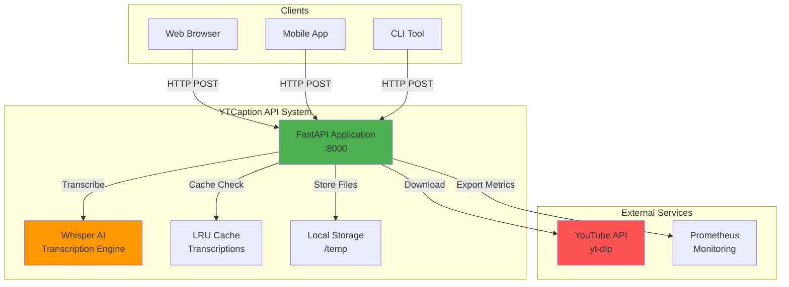
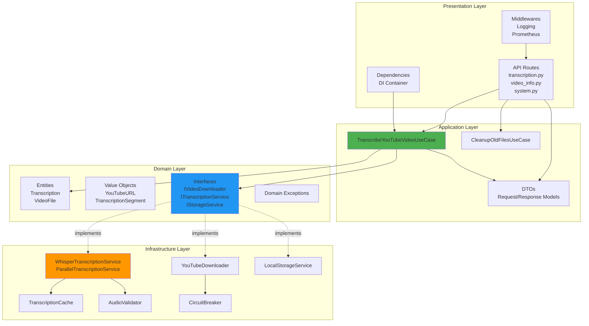
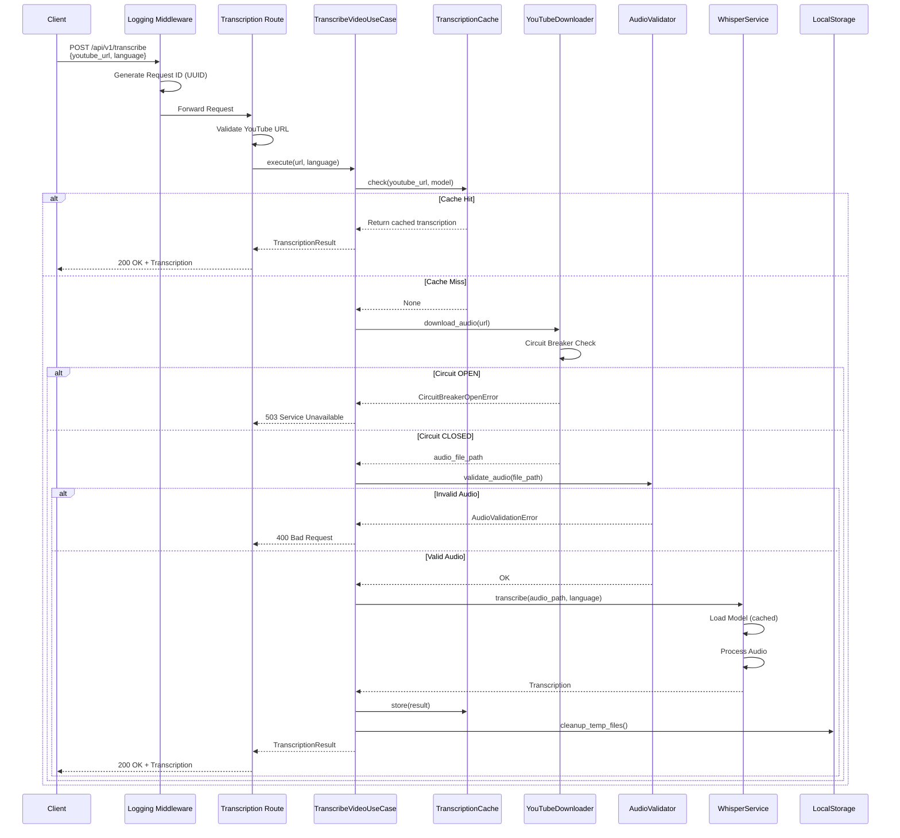
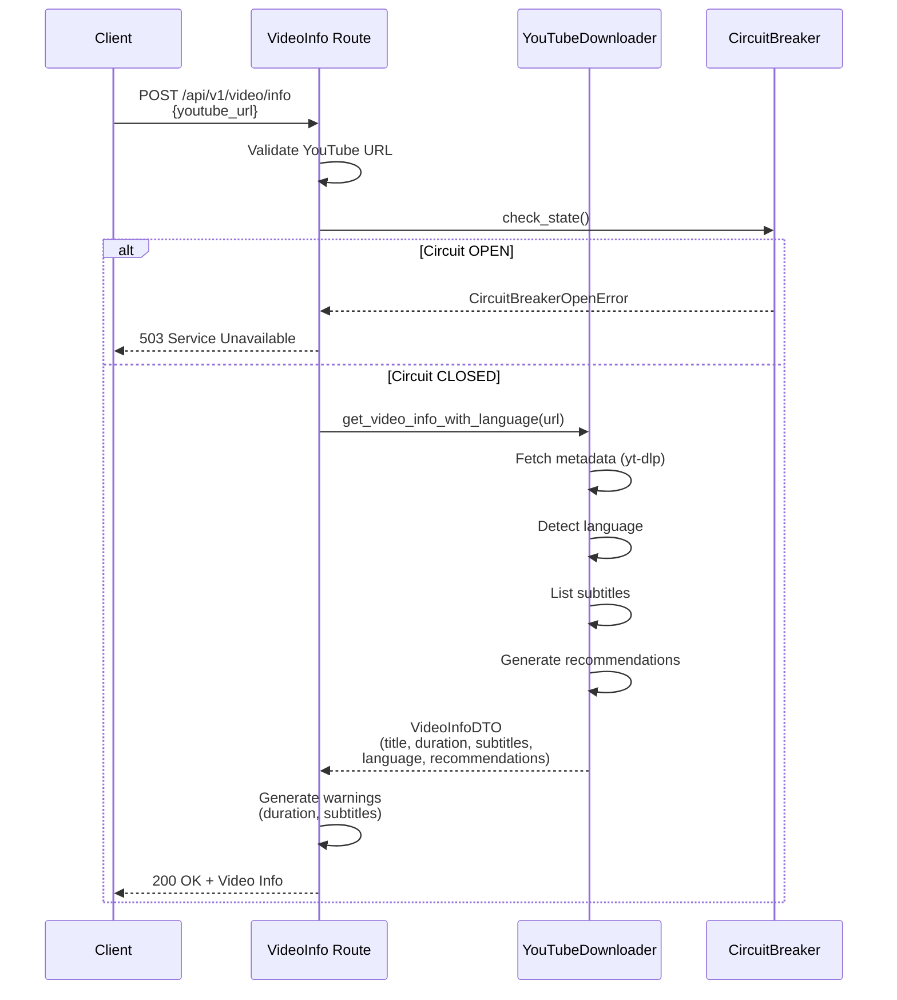
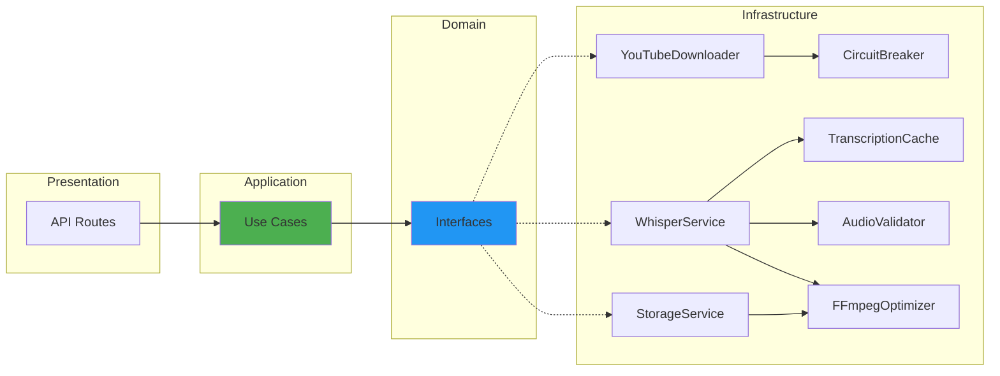
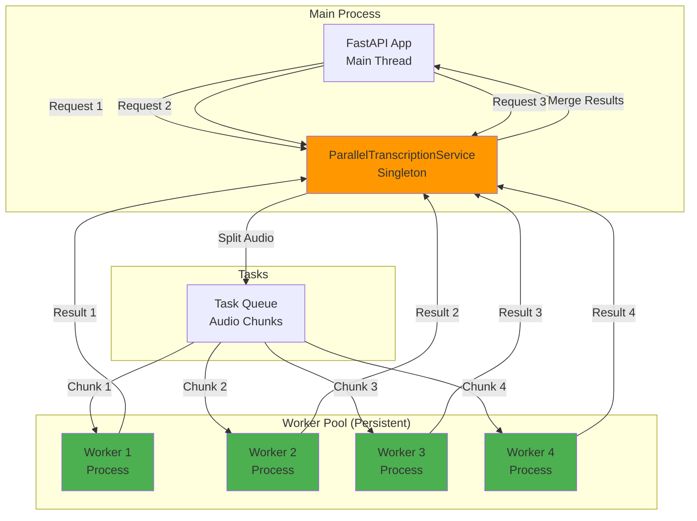
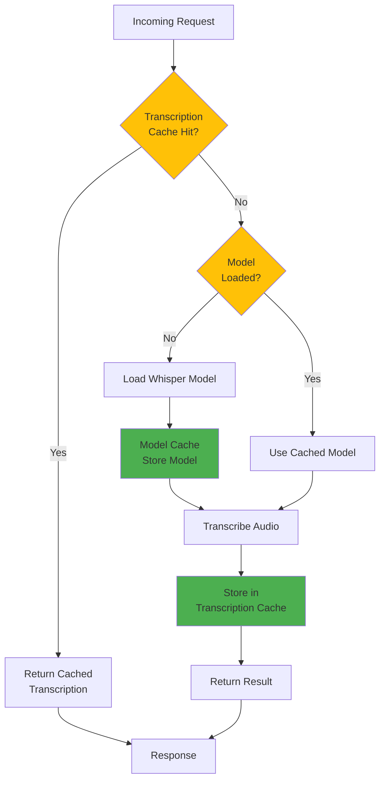
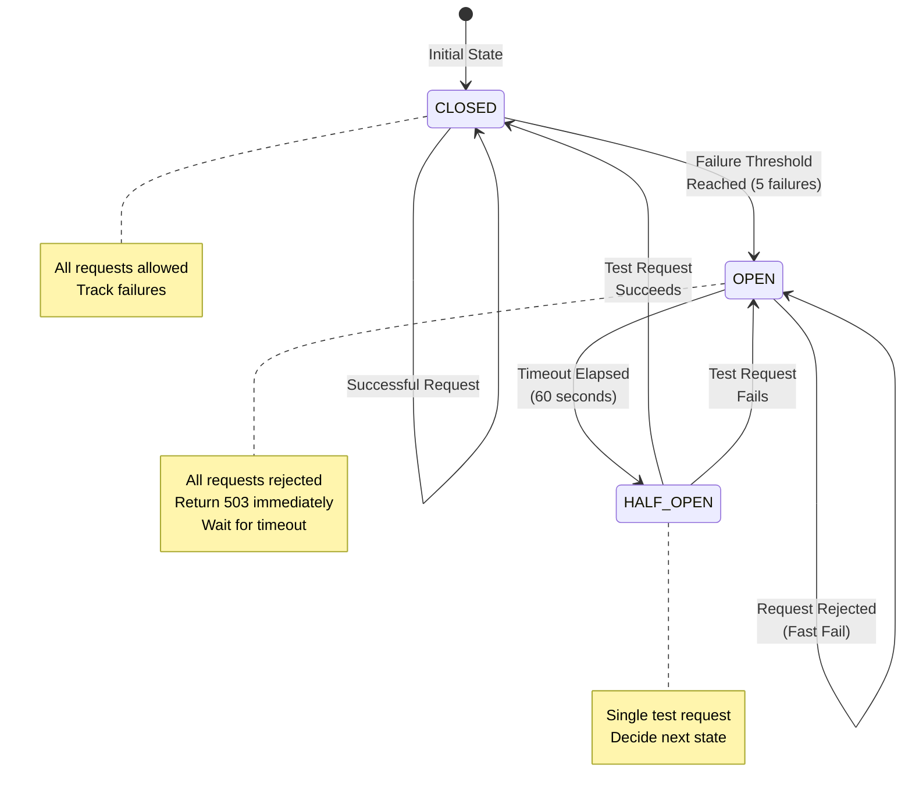
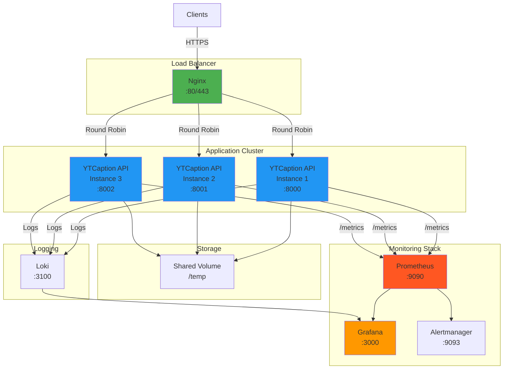

# YTCaption Architecture Diagrams

## Overview

This document provides comprehensive architectural diagrams for the YTCaption API system using Mermaid notation. These diagrams illustrate the system's layers, components, data flows, and interactions following Domain-Driven Design (DDD) and Clean Architecture principles.

---

## Table of Contents

1. [System Overview](#1-system-overview)
2. [DDD Layers Architecture](#2-ddd-layers-architecture)
3. [Request Flow - Transcription](#3-request-flow---transcription)
4. [Request Flow - Video Info](#4-request-flow---video-info)
5. [Component Dependencies](#5-component-dependencies)
6. [Worker Pool Architecture](#6-worker-pool-architecture)
7. [Cache Strategy](#7-cache-strategy)
8. [Circuit Breaker Pattern](#8-circuit-breaker-pattern)
9. [Deployment Architecture](#9-deployment-architecture)

---

## 1. System Overview

**High-level system architecture showing external integrations:**



---

## 2. DDD Layers Architecture

**Clean Architecture / DDD layers with dependency direction:**



---

## 3. Request Flow - Transcription

**Complete flow for POST /api/v1/transcribe:**



---

## 4. Request Flow - Video Info

**Flow for POST /api/v1/video/info (metadata only):**



---

## 5. Component Dependencies

**Dependency graph showing relationships:**



---

## 6. Worker Pool Architecture

**Parallel transcription with persistent worker pool:**



---

## 7. Cache Strategy

**Multi-level caching architecture:**



---

## 8. Circuit Breaker Pattern

**YouTube API protection with circuit breaker:**



---

## 9. Deployment Architecture

**Production deployment with Docker and monitoring:**



---

## Diagram Conventions

### Color Coding

| Color | Meaning |
|-------|---------|
| 🟢 Green (#4CAF50) | Application/Service components |
| 🔵 Blue (#2196F3) | Interfaces/Abstractions |
| 🟠 Orange (#FF9800) | Processing/Computation |
| 🔴 Red (#FF5252) | External Services |
| 🟡 Yellow (#FFC107) | Decision Points/Caching |

### Arrow Types

| Arrow | Meaning |
|-------|---------|
| `-->` | Direct dependency |
| `-.->` | Implementation |
| `==>` | Data flow |
| `->>` | Async/Message passing |

---

## How to Render Diagrams

### Option 1: GitHub/GitLab (Native Support)

Mermaid diagrams render automatically in Markdown files on GitHub and GitLab.

### Option 2: VS Code Extension

Install **Markdown Preview Mermaid Support** extension:
```bash
code --install-extension bierner.markdown-mermaid
```

### Option 3: Online Editor

Visit [Mermaid Live Editor](https://mermaid.live/):
- Copy diagram code
- Paste in editor
- Export as SVG/PNG

### Option 4: CLI Tool

```bash
npm install -g @mermaid-js/mermaid-cli

# Generate PNG
mmdc -i diagram.mmd -o diagram.png

# Generate SVG
mmdc -i diagram.mmd -o diagram.svg
```

---

## Related Documentation

- **System Overview**: `README.md` (Project introduction)
- **Architecture Guide**: `docs-en/09-ARCHITECTURE.md` (Detailed architecture explanation)
- **DDD Layers**: All module documentation in `docs-en/architecture/`
- **API Routes**: `docs-en/architecture/presentation/routes/`
- **Infrastructure**: `docs-en/architecture/infrastructure/`

---

## Version History

| Version | Date | Changes |
|---------|------|---------|
| v2.2 | 2024 | Added Circuit Breaker, Worker Pool, Cache Strategy diagrams |
| v2.0 | 2024 | Added DDD layers, deployment architecture |
| v1.0 | 2023 | Initial system overview and request flow diagrams |
