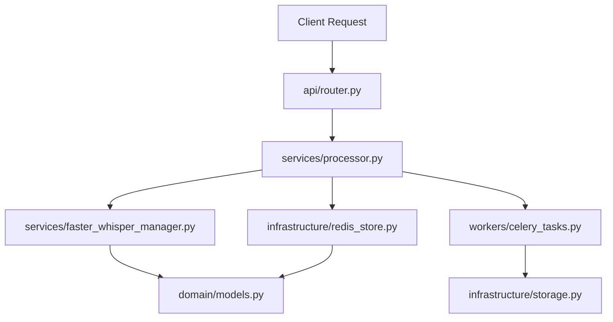

# 🏗️ Arquitetura do Projeto - YTCaption

> **Última atualização**: 2026-02-28  
> **Status**: ✅ Estrutura Modular Implementada

## 📐 Visão Geral

O YTCaption utiliza uma **arquitetura de microserviços** com **Clean Architecture** implementada em cada serviço. A estrutura foi recentemente reorganizada (fevereiro 2026) para seguir os princípios SOLID e facilitar manutenção e escalabilidade.

## 🎯 Princípios Arquiteturais

1. **Separação de Responsabilidades**: Cada módulo tem uma única responsabilidade
2. **Independência de Frameworks**: Lógica de negócio desacoplada de frameworks
3. **Testabilidade**: Componentes isolados facilitam testes unitários
4. **Inversão de Dependência**: Dependências apontam para abstrações
5. **Modularidade**: Código organizado em camadas bem definidas

---

## 🏢 Estrutura Geral dos Microserviços

```
YTCaption-Easy-Youtube-API/
├── orchestrator/           # Coordenador central (porta 8080)
├── services/
│   ├── video-downloader/   # Download YouTube (porta 8000)
│   ├── audio-normalization/ # Processamento áudio (porta 8003)
│   ├── audio-transcriber/  # Transcrição (porta 8004) ⭐ REORGANIZADO
│   ├── youtube-search/     # Busca vídeos (porta 8001)
│   └── make-video/         # Geração vídeos (porta 8005) ⭐ REFERÊNCIA
├── common/                 # Biblioteca compartilhada
└── docs/                   # Documentação centralizada
```

---

## 🎨 Arquitetura Modular (Clean Architecture)

### Estrutura Padrão por Serviço

Os serviços **audio-transcriber** e **make-video** seguem esta estrutura:

```
service/
├── app/
│   ├── api/              # 🌐 Camada de Apresentação (REST API)
│   │   ├── __init__.py
│   │   └── router.py     # Rotas FastAPI
│   │
│   ├── core/             # ⚙️ Configurações e Constantes
│   │   ├── __init__.py
│   │   ├── config.py     # Settings, env vars
│   │   └── logging_config.py
│   │
│   ├── domain/           # 🎯 Regras de Negócio (Entities)
│   │   ├── __init__.py
│   │   ├── models.py     # Modelos de dados (Pydantic)
│   │   ├── exceptions.py # Exceções customizadas
│   │   └── interfaces.py # Contratos/Abstrações (ABC)
│   │
│   ├── services/         # 💼 Lógica de Aplicação (Use Cases)
│   │   ├── __init__.py
│   │   ├── processor.py  # Orquestração principal
│   │   ├── faster_whisper_manager.py
│   │   ├── model_manager.py
│   │   └── device_manager.py
│   │
│   ├── infrastructure/   # 🔧 Detalhes Técnicos
│   │   ├── __init__.py
│   │   ├── redis_store.py    # Persistência
│   │   ├── storage.py        # Sistema de arquivos
│   │   └── circuit_breaker.py # Resiliência
│   │
│   ├── workers/          # ⚡ Background Processing
│   │   ├── __init__.py
│   │   ├── celery_config.py
│   │   └── celery_tasks.py
│   │
│   ├── shared/           # 🛠️ Utilitários Compartilhados
│   │   ├── __init__.py
│   │   ├── health_checker.py
│   │   ├── progress_tracker.py
│   │   └── orphan_cleaner.py
│   │
│   └── main.py           # 🚀 Entrada da aplicação (FastAPI app)
│
├── tests/                # 🧪 Testes organizados
│   ├── unit/
│   ├── integration/
│   └── e2e/
│
├── common/               # 📚 Biblioteca compartilhada (symlink)
├── Dockerfile
├── docker-compose.yml
├── requirements.txt
├── Makefile              # Automação de comandos
└── README.md
```

---

## 🔄 Fluxo de Dados (Audio Transcriber)

### Camadas e Responsabilidades



### 1. **API Layer** (`app/api/`)
- **Responsabilidade**: HTTP endpoints, validação de entrada
- **Tecnologia**: FastAPI
- **Exemplo**: `POST /jobs`, `GET /health`

### 2. **Domain Layer** (`app/domain/`)
- **Responsabilidade**: Modelos de dados, regras de negócio puras
- **Tecnologia**: Pydantic, ABC (interfaces)
- **Exemplo**: `Job`, `TranscriptionSegment`, `WhisperEngine`

### 3. **Services Layer** (`app/services/`)
- **Responsabilidade**: Casos de uso, orquestração de lógica
- **Tecnologia**: Python puro, whisper libraries
- **Exemplo**: `TranscriptionProcessor`, `FasterWhisperManager`

### 4. **Infrastructure Layer** (`app/infrastructure/`)
- **Responsabilidade**: Acesso a recursos externos (DB, cache, FS)
- **Tecnologia**: Redis, filesystem, circuit breaker
- **Exemplo**: `RedisJobStore`, `CircuitBreaker`

### 5. **Workers Layer** (`app/workers/`)
- **Responsabilidade**: Processamento assíncrono em background
- **Tecnologia**: Celery, Redis (broker)
- **Exemplo**: `process_transcription_task`

### 6. **Shared Layer** (`app/shared/`)
- **Responsabilidade**: Utilitários cross-cutting
- **Tecnologia**: Python utilities
- **Exemplo**: `HealthChecker`, `ProgressTracker`

---

## 📦 Common Library

Biblioteca compartilhada por todos os microserviços:

```
common/
├── config_utils/        # Configurações centralizadas
│   └── base_settings.py
├── exception_handlers/  # Handlers HTTP globais
│   └── handlers.py
├── log_utils/          # Logging estruturado
│   └── structured.py
├── models/             # Modelos compartilhados
│   └── base.py
└── redis_utils/        # Client Redis resiliente
    └── resilient_store.py
```

**Instalação em cada serviço:**
```bash
# Via symbolic link
ln -s ../../common ./common

# Ou via pip editable install
pip install -e ../../common
```

---

## 🔌 Comunicação Entre Serviços

### Padrões de Comunicação

1. **Síncrono (HTTP REST)**
   - Orchestrator → Services (health checks, job creation)
   - Client → Orchestrator (pipeline submission)

2. **Assíncrono (Message Queue)**
   - Celery tasks dentro de cada serviço
   - Redis como broker e result backend

3. **Cache Compartilhado (Redis)**
   - Jobs status
   - Results caching (24h TTL)
   - Distributed locks

### Exemplo: Pipeline Completo

```
1. Client POST → Orchestrator (/pipeline)
2. Orchestrator POST → Video Downloader (/jobs)
3. Video Downloader → Celery Task (background)
4. Celery Task → Redis (save result)
5. Orchestrator GET → Video Downloader (/jobs/{id}) [polling]
6. Orchestrator POST → Audio Normalization (/jobs)
7. ... (repeat pattern)
8. Orchestrator POST → Audio Transcriber (/jobs)
9. Audio Transcriber → services/processor.py
10. Processor → services/faster_whisper_manager.py
11. Faster Whisper → domain/models.py (segments with words)
12. Processor → infrastructure/redis_store.py (save)
13. Celery Task → infrastructure/storage.py (save files)
14. Orchestrator GET → Result (/jobs/{id}/download)
```

---

## 🛡️ Resiliência e Qualidade

### Circuit Breaker Pattern
```python
# infrastructure/circuit_breaker.py
class CircuitBreaker:
    threshold: int = 5          # Falhas antes de abrir
    timeout: int = 60           # Segundos em OPEN
    half_open_max_calls: int = 3  # Tentativas em HALF_OPEN
```

### Retry com Tenacity
```python
@retry(
    stop=stop_after_attempt(3),
    wait=wait_exponential(multiplier=1, min=2, max=10)
)
def download_with_retry(url: str):
    ...
```

### Health Checks
- **Liveness**: `/health` (200 OK se serviço responde)
- **Readiness**: Verifica Redis, FFmpeg, Models loaded
- **Deep Check**: Valida dependências críticas

---

## 📊 Métricas e Observabilidade

### Logging Estruturado
```python
from common.log_utils import get_logger

logger = get_logger(__name__)
logger.info("Transcription completed", extra={
    "job_id": job.id,
    "duration": duration,
    "word_count": len(words),
    "language": detected_language
})
```

### Structured Output (JSON)
```json
{
  "timestamp": "2026-02-28T15:30:45.123Z",
  "level": "INFO",
  "service": "audio-transcriber",
  "message": "Transcription completed",
  "job_id": "trans_abc123",
  "duration": 180.5,
  "word_count": 425
}
```

---

## 🚀 Deployment

### Docker Compose (Production)

```yaml
services:
  audio-transcriber-api:
    build: ./services/audio-transcriber
    ports:
      - "8004:8004"
    environment:
      - WHISPER_DEVICE=cpu
      - REDIS_URL=redis://redis:6379/2
    depends_on:
      - redis
    
  audio-transcriber-celery:
    build: ./services/audio-transcriber
    command: celery -A app.celery_config worker --loglevel=info
    depends_on:
      - redis
      
  redis:
    image: redis:7-alpine
    ports:
      - "6379:6379"
```

### Makefile Commands

Todos os serviços possuem Makefile padronizado:

```bash
# Desenvolvimento local
make install          # Instalar dependências
make dev              # Rodar em modo dev
make test             # Rodar testes

# Docker
make build            # Build images
make up               # Subir containers
make down             # Derrubar containers
make restart          # Reiniciar serviços
make logs             # Ver logs

# Testes avançados (make-video)
make test-coverage    # Coverage report
make test-validate    # Zero mocks, zero skips
make calibrate        # Otimização de parâmetros
```

---

## 📚 Referências

### Documentação por Serviço
- [Audio Transcriber](./services/audio-transcriber/README.md) - ⭐ Estrutura modular
- [Make Video](../services/make-video/docs/README.md) - ⭐ Referência arquitetural
- [Video Downloader](./services/video-downloader/README.md)
- [Audio Normalization](./services/audio-normalization/README.md)
- [YouTube Search](./services/youtube-search/README.md)

### Guias Técnicos
- [FINAL_REPORT.md](../FINAL_REPORT.md) - Relatório completo da reorganização
- [REORGANIZATION_STATUS.md](../services/audio-transcriber/REORGANIZATION_STATUS.md) - Detalhes técnicos

### Padrões e Convenções
- Clean Architecture (Uncle Bob)
- SOLID Principles
- Repository Pattern (infrastructure layer)
- Dependency Injection (através de interfaces)
- Command Query Responsibility Segregation (CQRS) parcial

---

## 🎯 Próximos Passos Arquiteturais

### Em Progresso
- ✅ Audio-transcriber: Estrutura modular completa
- ✅ Make-video: Estrutura madura com calibração
- ⏳ Demais serviços: Migração gradual para estrutura modular

### Planejado
- 🔄 Extrair rotas do main.py para app/api/router.py
- 🔄 Implementar event sourcing para auditoria
- 🔄 Adicionar OpenTelemetry para tracing distribuído
- 🔄 Implementar rate limiting distribuído (Redis)
- 🔄 CI/CD pipeline com GitHub Actions

---

**Mantido por**: John Heberty  
**Última revisão**: 28/02/2026  
**Versão**: 2.0.0 (Clean Architecture)
