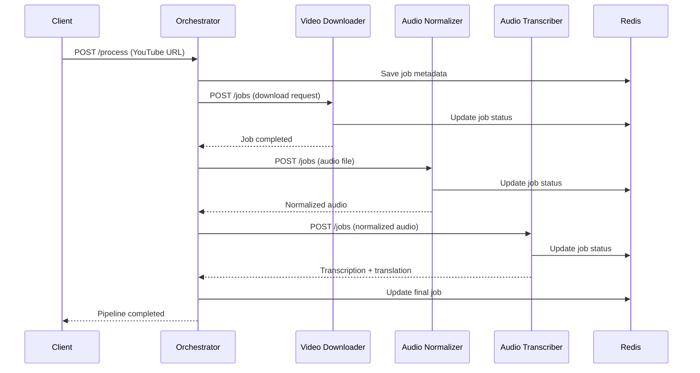

# 🛠️ Guia de Desenvolvimento

Guia completo para desenvolvimento e contribuição no YTCaption API.

## 🏗️ Arquitetura do Sistema

### Visão Geral


### Componentes

1. **Orchestrator** - Coordenação e orquestração
2. **Video Downloader** - Download e extração de áudio
3. **Audio Normalizer** - Processamento de áudio
4. **Audio Transcriber** - Transcrição e tradução
5. **Redis** - Cache e storage compartilhado

## 🚀 Setup de Desenvolvimento

### Requisitos
- Python 3.9+
- Redis Server
- FFmpeg
- CUDA (opcional, para Whisper GPU)

### Instalação Local

```bash
# Clone o repositório
git clone https://github.com/JohnHeberty/YTCaption-Easy-Youtube-API.git
cd YTCaption-Easy-Youtube-API

# Setup Redis
docker run -d -p 6379:6379 redis:alpine

# Setup cada serviço
cd orchestrator
pip install -r requirements.txt
cp .env.example .env
# Edite .env conforme necessário

cd ../services/video-downloader
pip install -r requirements.txt
cp .env.example .env

cd ../audio-normalization  
pip install -r requirements.txt
cp .env.example .env

cd ../audio-transcriber
pip install -r requirements.txt
cp .env.example .env
```

### Desenvolvimento com Docker

```yaml
# docker-compose.dev.yml
version: '3.8'
services:
  redis:
    image: redis:alpine
    ports:
      - "6379:6379"
  
  orchestrator:
    build: ./orchestrator
    ports:
      - "8080:8080"
    volumes:
      - ./orchestrator:/app
    environment:
      - DEBUG=true
      - RELOAD=true
  
  # ... outros serviços
```

```bash
# Iniciar ambiente de desenvolvimento
docker-compose -f docker-compose.dev.yml up -d
```

## 🧪 Testes

### Estrutura de Testes
```
tests/
├── unit/           # Testes unitários
├── integration/    # Testes de integração  
├── e2e/           # Testes end-to-end
├── fixtures/      # Dados de teste
└── conftest.py    # Configuração pytest
```

### Executar Testes

```bash
# Testes unitários
pytest tests/unit/ -v

# Testes de integração
pytest tests/integration/ -v

# Testes E2E (requer serviços rodando)
pytest tests/e2e/ -v

# Coverage
pytest --cov=app tests/
```

### Exemplo de Teste
```python
# tests/unit/test_orchestrator.py
import pytest
from unittest.mock import AsyncMock, Mock
from orchestrator.modules.orchestrator import PipelineOrchestrator

@pytest.fixture
def mock_clients():
    return {
        'video': AsyncMock(),
        'audio': AsyncMock(), 
        'transcriber': AsyncMock()
    }

@pytest.mark.asyncio
async def test_pipeline_success(mock_clients):
    orchestrator = PipelineOrchestrator()
    
    # Mock successful responses
    mock_clients['video'].submit_json.return_value = {"job_id": "test_123"}
    mock_clients['video'].download_file.return_value = (b"audio_data", "test.webm")
    
    job = PipelineJob.create_new("https://youtube.com/watch?v=test")
    result = await orchestrator.execute_pipeline(job)
    
    assert result.status == PipelineStatus.COMPLETED
```

## 📝 Padrões de Código

### Estrutura de Projeto
```
service-name/
├── app/
│   ├── __init__.py
│   ├── main.py         # FastAPI app
│   ├── models.py       # Pydantic models
│   ├── config.py       # Configurações
│   ├── processor.py    # Lógica de negócio
│   └── redis_store.py  # Interface Redis
├── tests/
├── logs/
├── requirements.txt
├── Dockerfile
└── README.md
```

### Convenções

#### Naming
- **Classes**: PascalCase (`PipelineJob`)
- **Functions**: snake_case (`execute_pipeline`)
- **Constants**: UPPER_SNAKE_CASE (`MAX_FILE_SIZE`)
- **Files**: snake_case (`redis_store.py`)

#### Error Handling
```python
# Sempre usar exceptions específicas
class VideoDownloadException(Exception):
    pass

# Logging estruturado
logger.error(f"[{service_name}] {operation} failed: {error}", 
             extra={"job_id": job_id, "service": service_name})
```

#### Async/Await
```python
# Sempre usar async para I/O
async def download_file(url: str) -> bytes:
    async with httpx.AsyncClient() as client:
        response = await client.get(url)
        return response.content

# Context managers para recursos
async with httpx.AsyncClient(timeout=timeout) as client:
    # operações
```

### Code Style

```bash
# Formatação
black app/ tests/
isort app/ tests/

# Linting
flake8 app/ tests/
mypy app/

# Pre-commit hooks
pre-commit install
```

## 🔧 APIs e Contratos

### Request/Response Patterns

#### Job Creation
```python
# Request
class JobRequest(BaseModel):
    url: str = Field(..., description="YouTube URL")
    quality: str = Field("audio", description="Quality")

# Response  
class JobResponse(BaseModel):
    id: str
    status: JobStatus
    created_at: datetime
    progress: float = 0.0
```

#### Error Responses
```python
# Padronização de erros
{
  "error": "VIDEO_NOT_FOUND",
  "message": "Video not available or private",
  "details": {
    "url": "https://youtube.com/watch?v=invalid",
    "code": 404
  },
  "timestamp": "2025-10-29T15:30:00Z"
}
```

### Circuit Breaker Pattern
```python
class CircuitBreaker:
    def __init__(self, failure_threshold=5, recovery_timeout=300):
        self.failure_threshold = failure_threshold
        self.recovery_timeout = recovery_timeout
        self.failure_count = 0
        self.last_failure_time = None
        self.state = "CLOSED"  # CLOSED, OPEN, HALF_OPEN
    
    async def call(self, func, *args, **kwargs):
        if self.state == "OPEN":
            if self._should_attempt_reset():
                self.state = "HALF_OPEN"
            else:
                raise CircuitBreakerOpenError()
        
        try:
            result = await func(*args, **kwargs)
            self._on_success()
            return result
        except Exception as e:
            self._on_failure()
            raise
```

## 📊 Monitoramento e Observabilidade

### Logging
```python
import structlog

logger = structlog.get_logger()

# Logs estruturados
logger.info("Pipeline started", 
           job_id=job.id, 
           youtube_url=job.url,
           pipeline_stage="download")

logger.error("Download failed",
            job_id=job.id,
            error=str(e),
            retry_count=attempt,
            service="video-downloader")
```

### Métricas
```python
# Exemplo com Prometheus
from prometheus_client import Counter, Histogram, Gauge

# Contadores
JOBS_TOTAL = Counter('jobs_total', 'Total jobs', ['service', 'status'])
JOBS_TOTAL.labels(service='video-downloader', status='completed').inc()

# Histogramas para duração
PROCESSING_TIME = Histogram('processing_duration_seconds', 'Processing time')
with PROCESSING_TIME.time():
    await process_job()

# Gauges para valores atuais
ACTIVE_JOBS = Gauge('active_jobs', 'Active jobs')
ACTIVE_JOBS.set(len(active_jobs))
```

### Health Checks
```python
async def health_check():
    checks = {
        "redis": await check_redis(),
        "disk_space": check_disk_space(),
        "dependencies": await check_dependencies()
    }
    
    overall_status = "healthy" if all(checks.values()) else "degraded"
    
    return {
        "status": overall_status,
        "checks": checks,
        "timestamp": datetime.utcnow().isoformat()
    }
```

## 🚀 Deploy e CI/CD

### Docker Multi-stage
```dockerfile
# Dockerfile
FROM python:3.9-slim as builder
WORKDIR /app
COPY requirements.txt .
RUN pip install --user -r requirements.txt

FROM python:3.9-slim as runtime
WORKDIR /app
COPY --from=builder /root/.local /root/.local
COPY app/ ./app/
ENV PATH=/root/.local/bin:$PATH
CMD ["python", "-m", "app.main"]
```

### GitHub Actions
```yaml
# .github/workflows/ci.yml
name: CI/CD Pipeline
on: [push, pull_request]

jobs:
  test:
    runs-on: ubuntu-latest
    services:
      redis:
        image: redis:alpine
        ports:
          - 6379:6379
    
    steps:
      - uses: actions/checkout@v3
      - uses: actions/setup-python@v4
        with:
          python-version: '3.9'
      
      - name: Install dependencies
        run: pip install -r requirements.txt -r requirements-test.txt
      
      - name: Run tests
        run: pytest --cov=app tests/
      
      - name: Build Docker image
        run: docker build -t ytcaption/service:${{ github.sha }} .
```

## 🔒 Segurança

### Input Validation
```python
from pydantic import BaseModel, HttpUrl, validator

class JobRequest(BaseModel):
    url: HttpUrl  # Automaticamente valida URL
    
    @validator('url')
    def validate_youtube_url(cls, v):
        if 'youtube.com' not in str(v) and 'youtu.be' not in str(v):
            raise ValueError('Only YouTube URLs are allowed')
        return v
```

### Rate Limiting
```python
from slowapi import Limiter, _rate_limit_exceeded_handler
from slowapi.util import get_remote_address

limiter = Limiter(key_func=get_remote_address)

@app.post("/jobs")
@limiter.limit("10/minute")
async def create_job(request: Request, job_request: JobRequest):
    # implementação
```

### Secrets Management
```python
import os
from cryptography.fernet import Fernet

# Nunca hardcode secrets
OPENAI_API_KEY = os.getenv("OPENAI_API_KEY")
if not OPENAI_API_KEY:
    raise ValueError("OPENAI_API_KEY environment variable required")

# Criptografia para dados sensíveis
def encrypt_data(data: str, key: bytes) -> str:
    f = Fernet(key)
    return f.encrypt(data.encode()).decode()
```

## 🤝 Contribuição

### Pull Request Process
1. Fork o repositório
2. Criar branch feature: `git checkout -b feature/nova-funcionalidade`
3. Implementar mudanças com testes
4. Executar formatação: `black . && isort .`
5. Executar testes: `pytest`
6. Commit com mensagem descritiva
7. Push e criar Pull Request

### Commit Convention
```
feat: adiciona suporte a tradução automática
fix: corrige timeout no video downloader  
docs: atualiza documentação da API
test: adiciona testes para circuit breaker
refactor: melhora estrutura do orchestrator
```

### Code Review Checklist
- [ ] Código segue padrões do projeto
- [ ] Testes unitários incluídos
- [ ] Documentação atualizada
- [ ] Logs estruturados adicionados
- [ ] Error handling adequado
- [ ] Performance considerada
- [ ] Segurança validada

---

**Atualizado**: Outubro 2025 | **Versão**: 2.0.0