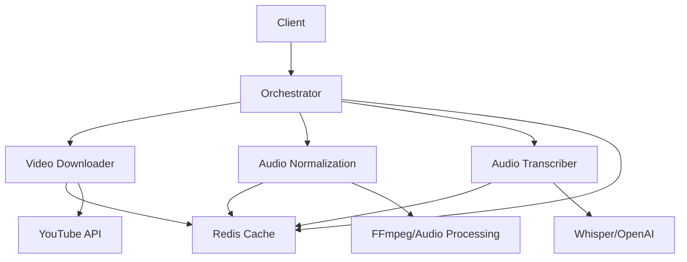

# 🎥 YTCaption - Easy YouTube API

Sistema completo de microserviços para processamento de vídeos do YouTube com pipeline automatizado de download, normalização de áudio e transcrição.

## 🏗️ Arquitetura



## 🚀 Serviços

### 📋 [Orchestrator](./orchestrator/README.md)
**Porta: 8080** - Coordena todo o pipeline e gerencia os microserviços
- Submissão de jobs
- Gerenciamento de pipeline
- Circuit breaker e retry inteligente
- Health checks dos microserviços

### 📥 [Video Downloader](./services/video-downloader/README.md)
**Porta: 8000** - Download de vídeos do YouTube
- Download em múltiplas qualidades
- Cache inteligente de 24h
- Sistema de User-Agents rotativos
- Background processing com Celery

### 🔊 [Audio Normalization](./services/audio-normalization/README.md)
**Porta: 8001** - Processamento e normalização de áudio
- Remoção de ruído
- Conversão para mono
- Filtragem high-pass
- Isolamento de vocais

### 📝 [Audio Transcriber](./services/audio-transcriber/README.md)
**Porta: 8004** - Transcrição e tradução de áudio  
**Arquitetura**: ⭐ Clean Architecture (modular) - [Ver detalhes](./ARCHITECTURE.md#audio-transcriber)
- Transcrição com Whisper (faster-whisper)
- Word-level timestamps nativos
- Múltiplos engines (faster-whisper, whisperx, openai-whisper)
- Dropdown de engines no /docs
- Segmentação com timestamps precisos
- Estrutura modular: domain/services/infrastructure

## 🔧 Pipeline Completo

1. **Submissão**: Cliente envia URL do YouTube para o Orchestrator
2. **Download**: Video Downloader extrai áudio do vídeo
3. **Normalização**: Audio Normalization processa e limpa o áudio
4. **Transcrição**: Audio Transcriber gera texto e timestamps
5. **Entrega**: Cliente recebe texto, segments e arquivos processados

## ⚡ Características

- **Resiliência Total**: Circuit breaker, retry exponencial, health checks
- **Polling Adaptativo**: 2s inicial → 30s para jobs longos
- **Cache Inteligente**: 24h de cache para evitar reprocessamento
- **Background Processing**: Celery + Redis para performance
- **Monitoramento**: Logs estruturados e métricas detalhadas
- **Escalabilidade**: Arquitetura de microserviços independentes

## 🛠️ Configuração Rápida

```bash
# Clone o repositório
git clone https://github.com/JohnHeberty/YTCaption-Easy-Youtube-API.git
cd YTCaption-Easy-Youtube-API

# Configure variáveis de ambiente
cp orchestrator/.env.example orchestrator/.env
# Edite orchestrator/.env com suas configurações

# Inicie com Docker Compose
docker-compose up -d

# Ou inicie cada serviço individualmente
cd orchestrator && python main.py &
cd services/video-downloader && python run.py &
cd services/audio-normalization && python run.py &
cd services/audio-transcriber && python run.py &
```

## 📊 Monitoramento

- **Orchestrator Health**: `GET http://localhost:8080/health`
- **Pipeline Status**: `GET http://localhost:8080/jobs/{job_id}`
- **Stats Gerais**: `GET http://localhost:8080/admin/stats`

## 🔗 Links Rápidos

- [🏗️ Arquitetura Completa](./ARCHITECTURE.md) - ⭐ **NOVO**: Estrutura modular detalhada
- [Configuração do Orchestrator](./orchestrator/README.md#configuração)
- [API Endpoints](./orchestrator/README.md#endpoints)
- [Troubleshooting](./orchestrator/README.md#troubleshooting)
- [Desenvolvimento](./DEVELOPMENT.md)

---

**Versão**: 2.0.0 | **Atualizado**: Outubro 2025