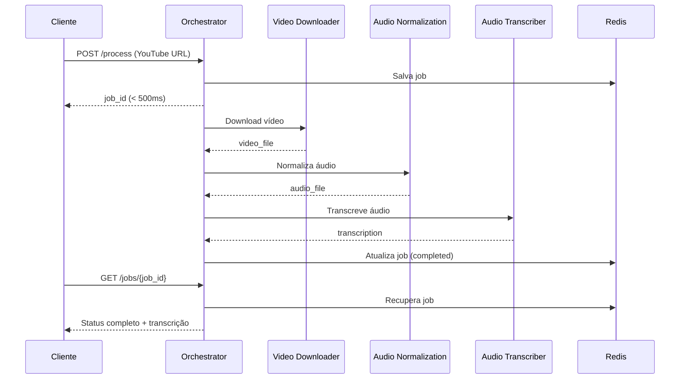

# YouTube Caption Orchestrator API 🎬

API orquestradora que coordena o pipeline completo de processamento de vídeos do YouTube: **download** → **normalização de áudio** → **transcrição**.

## 📋 Visão Geral

Esta API recebe uma URL do YouTube e automaticamente:

1. **Download do vídeo** (via `video-downloader`)
2. **Normalização de áudio** (via `audio-normalization`)
3. **Transcrição com Whisper AI** (via `audio-transcriber`)

Retorna imediatamente com um `job_id` para acompanhamento do progresso em tempo real.

## 🏗️ Arquitetura

```
┌─────────────────────────────────────────────────────────────┐
│                  Orchestrator API (8000)                    │
│                                                             │
│  POST /process → Cria job e coordena pipeline              │
│  GET /jobs/{id} → Consulta status e progresso              │
└─────────────────────────────────────────────────────────────┘
                            │
                ┌───────────┼───────────┐
                │           │           │
                ▼           ▼           ▼
    ┌───────────────┐ ┌──────────────┐ ┌──────────────────┐
    │  Video        │ │  Audio       │ │  Audio           │
    │  Downloader   │ │  Normalization│ │  Transcriber    │
    │  (8001)       │ │  (8002)      │ │  (8003)          │
    └───────────────┘ └──────────────┘ └──────────────────┘
```

## 🚀 Início Rápido

### Pré-requisitos

- Python 3.11+
- Redis (192.168.18.110:6379)
- Microserviços rodando:
  - `video-downloader` na porta 8001
  - `audio-normalization` na porta 8002
  - `audio-transcriber` na porta 8003

### Instalação Local

```bash
# Clone e entre no diretório
cd orchestrator

# Crie ambiente virtual
python -m venv venv
source venv/bin/activate  # Windows: venv\Scripts\activate

# Instale dependências
pip install -r requirements.txt

# Configure variáveis de ambiente
cp .env.example .env
# Edite .env com suas configurações

# Inicie o servidor
python run.py
```

### Docker

```bash
# Build
docker build -t ytcaption-orchestrator .

# Run
docker-compose up -d

# Logs
docker-compose logs -f orchestrator
```

## 📡 Endpoints

### `POST /process` - Inicia Pipeline

Inicia processamento completo de um vídeo do YouTube.

**Request:**
```json
{
  "youtube_url": "https://www.youtube.com/watch?v=dQw4w9WgXcQ",
  "language": "auto",
  "remove_noise": true,
  "convert_to_mono": true,
  "sample_rate_16k": true
}
```

**Response (< 500ms):**
```json
{
  "job_id": "abc123def456",
  "status": "queued",
  "message": "Pipeline iniciado com sucesso. Use /jobs/{job_id} para acompanhar o progresso.",
  "youtube_url": "https://www.youtube.com/watch?v=dQw4w9WgXcQ",
  "overall_progress": 0.0
}
```

### `GET /jobs/{job_id}` - Consulta Status

Retorna status detalhado do pipeline e de cada estágio.

**Response:**
```json
{
  "job_id": "abc123def456",
  "youtube_url": "https://www.youtube.com/watch?v=dQw4w9WgXcQ",
  "status": "transcribing",
  "overall_progress": 75.5,
  "created_at": "2024-01-15T10:30:00",
  "updated_at": "2024-01-15T10:35:30",
  "completed_at": null,
  "stages": {
    "download": {
      "status": "completed",
      "job_id": "video_job_123",
      "progress": 100.0,
      "started_at": "2024-01-15T10:30:05",
      "completed_at": "2024-01-15T10:32:15",
      "error": null
    },
    "normalization": {
      "status": "completed",
      "job_id": "audio_job_456",
      "progress": 100.0,
      "started_at": "2024-01-15T10:32:20",
      "completed_at": "2024-01-15T10:33:45",
      "error": null
    },
    "transcription": {
      "status": "processing",
      "job_id": "trans_job_789",
      "progress": 65.0,
      "started_at": "2024-01-15T10:33:50",
      "completed_at": null,
      "error": null
    }
  },
  "transcription_text": null,
  "transcription_file": null,
  "audio_file": "/processed/audio_normalized_abc123.wav",
  "error_message": null
}
```

### `GET /jobs` - Lista Jobs

Lista jobs recentes (máximo 50).

**Response:**
```json
{
  "total": 10,
  "jobs": [
    {
      "job_id": "abc123",
      "youtube_url": "https://youtube.com/watch?v=...",
      "status": "completed",
      "progress": 100.0,
      "created_at": "2024-01-15T10:30:00",
      "updated_at": "2024-01-15T10:40:00"
    }
  ]
}
```

### `GET /health` - Health Check

Verifica saúde do orquestrador e microserviços.

**Response:**
```json
{
  "status": "healthy",
  "service": "orchestrator",
  "version": "1.0.0",
  "timestamp": "2024-01-15T10:30:00",
  "microservices": {
    "video-downloader": "healthy",
    "audio-normalization": "healthy",
    "audio-transcriber": "healthy"
  }
}
```

### `GET /admin/stats` - Estatísticas

Retorna estatísticas do sistema.

### `POST /admin/cleanup` - Limpeza

Remove jobs antigos do Redis.

## ⚙️ Configuração

### Variáveis de Ambiente

```bash
# Aplicação
APP_NAME=youtube-caption-orchestrator
APP_VERSION=1.0.0
ENVIRONMENT=production
DEBUG=false
APP_HOST=0.0.0.0
APP_PORT=8000
WORKERS=4

# Redis
REDIS_URL=redis://192.168.18.110:6379/0

# Cache
CACHE_TTL_HOURS=24
JOB_TIMEOUT_MINUTES=60

# Microserviços
VIDEO_DOWNLOADER_URL=http://localhost:8001
AUDIO_NORMALIZATION_URL=http://localhost:8002
AUDIO_TRANSCRIBER_URL=http://localhost:8003

# Timeouts (segundos)
VIDEO_DOWNLOADER_TIMEOUT=300
AUDIO_NORMALIZATION_TIMEOUT=180
AUDIO_TRANSCRIBER_TIMEOUT=600

# Polling
POLL_INTERVAL=2
MAX_POLL_ATTEMPTS=300

# Defaults
DEFAULT_LANGUAGE=auto
DEFAULT_REMOVE_NOISE=true
DEFAULT_CONVERT_MONO=true
DEFAULT_SAMPLE_RATE_16K=true
```

## 🔄 Fluxo de Pipeline



## 📊 Status dos Estágios

### Pipeline Status
- `queued` - Job criado, aguardando execução
- `downloading` - Download do vídeo em progresso
- `normalizing` - Normalização de áudio em progresso
- `transcribing` - Transcrição em progresso
- `completed` - Pipeline completo com sucesso
- `failed` - Falha em algum estágio
- `cancelled` - Pipeline cancelado

### Stage Status
- `pending` - Estágio não iniciado
- `processing` - Estágio em execução
- `completed` - Estágio completo
- `failed` - Estágio falhou
- `skipped` - Estágio pulado

## 🛠️ Desenvolvimento

### Estrutura do Projeto

```
orchestrator/
├── main.py                 # FastAPI app principal
├── run.py                  # Script de inicialização
├── requirements.txt        # Dependências Python
├── Dockerfile             # Container Docker
├── docker-compose.yml     # Orquestração Docker
├── .env.example           # Exemplo de configuração
├── modules/
│   ├── config.py          # Configurações
│   ├── models.py          # Modelos Pydantic
│   ├── orchestrator.py    # Lógica de orquestração
│   └── redis_store.py     # Store Redis
└── logs/                  # Logs da aplicação
```

### Resiliência

✅ **Job retorna imediatamente** (< 500ms)
- Pipeline executa em background
- Cliente acompanha via polling de `/jobs/{job_id}`

✅ **Polling inteligente**
- Intervalo de 2s entre consultas
- Máximo de 300 tentativas (10 minutos)
- Atualização de progresso em tempo real

✅ **Tratamento de erros**
- Cada estágio independente
- Erro em um estágio não bloqueia os anteriores
- Mensagens de erro detalhadas por estágio

✅ **Persistência**
- Jobs armazenados no Redis com TTL de 24h
- Recuperação automática após restart
- Cleanup automático de jobs antigos

## 🧪 Testes

```bash
# Teste de saúde
curl http://localhost:8000/health

# Inicia pipeline
curl -X POST http://localhost:8000/process \
  -H "Content-Type: application/json" \
  -d '{
    "youtube_url": "https://www.youtube.com/watch?v=dQw4w9WgXcQ",
    "language": "pt"
  }'

# Consulta status
curl http://localhost:8000/jobs/{job_id}
```

## 📝 Logs

Logs são salvos em `./logs/orchestrator.log` com o formato:

```
2024-01-15 10:30:00 - orchestrator - INFO - Starting pipeline for job abc123
2024-01-15 10:30:05 - orchestrator - INFO - Video download job submitted: video_job_123
2024-01-15 10:32:15 - orchestrator - INFO - Job video_job_123 completed
2024-01-15 10:32:20 - orchestrator - INFO - Audio normalization job submitted: audio_job_456
```

## 🔐 Segurança

- CORS habilitado para todos origins (ajuste em produção)
- Timeouts configuráveis por microserviço
- Health checks dos microserviços antes de executar
- TTL automático de jobs no Redis

## 📈 Performance

- **Resposta imediata**: Job criado em < 500ms
- **Pipeline em background**: Não bloqueia API
- **Polling eficiente**: 2s de intervalo
- **Cache Redis**: TTL de 24h
- **Workers**: 4 workers em produção

## 🐛 Troubleshooting

### Microserviço não responde
```bash
# Verifique saúde
curl http://localhost:8000/health

# Logs do orquestrador
docker-compose logs -f orchestrator
```

### Job travado
```bash
# Consulte status detalhado
curl http://localhost:8000/jobs/{job_id}

# Verifique logs de cada microserviço
docker-compose logs -f video-downloader
docker-compose logs -f audio-normalization
docker-compose logs -f audio-transcriber
```

### Redis desconectado
```bash
# Teste conexão Redis
redis-cli -h 192.168.18.110 -p 6379 ping
```

## 📄 Licença

Este projeto faz parte do sistema YouTube Caption Easy.

---

**Desenvolvido com ❤️ usando FastAPI, Redis e Whisper AI**
