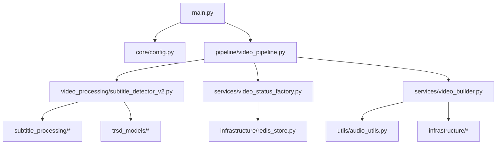

# 🎯 PLANEJAMENTO COMPLETO DE SPRINTS - PYTEST MAKE-VIDEO SERVICE

**Documento Executivo - Validação 100% Real Sem Mocks**

---

## 📋 SUMÁRIO EXECUTIVO

### Problema Identificado
- **Erro em Produção**: `KeyError: 'transform_dir'` na linha 282 de `video_pipeline.py`
- **Causa Raiz**: Dicionário retornado por `get_settings()` não inclui as chaves `'transform_dir'`, `'validate_dir'`, e outras necessárias
- **Impacto**: Job CRON `cleanup_orphaned_videos_cron` falhando a cada 5 minutos
- **Solução**: Validação completa com pytest em todos os 95 arquivos Python do diretório `app/`

### Estratégia de Testes
- **Tipo**: 100% Real (sem mocks)
- **Cobertura**: Todos os arquivos `.py` em `app/`
- **Abordagem**: Uma sprint por módulo principal, testes incrementais
- **Duração Total Estimada**: 40-50 horas de trabalho (8-10 sprints)

---

## 🗺️ MAPEAMENTO DE ARQUIVOS E MÓDULOS

### Estrutura Completa do Diretório `app/`

```
app/ (95 arquivos Python)
├── main.py                           # FastAPI application + APScheduler
├── api/                              # 2 arquivos - Cliente HTTP
├── core/                             # 4 arquivos - Configuração e modelos
├── domain/                           # 10 arquivos - Job processor + 8 stages
├── infrastructure/                   # 12 arquivos - Recursos e serviços
├── pipeline/                         # 2 arquivos - Orquestração principal
├── services/                         # N arquivos - Serviços de negócio
├── shared/                           # 6 arquivos - Exceções, eventos, validação
├── subtitle_processing/              # 6 arquivos - OCR e classificação
├── trsd_models/                      # 2 arquivos - Modelos de região de texto
├── utils/                            # 5 arquivos - Audio, VAD, timeout
└── video_processing/                 # ~40 arquivos - Detecção, extração, features
```

### Dependências Entre Módulos



---

## 🏃 ESTRUTURA DE SPRINTS

### Hierarquia de Prioridades (Bottom-Up)

1. **Camada Base**: `core/` - Configuração e modelos
2. **Camada Utilitária**: `utils/`, `shared/` - Funções auxiliares
3. **Camada Infraestrutura**: `infrastructure/` - Redis, logging, metrics
4. **Camada Processamento**: `video_processing/`, `subtitle_processing/`, `trsd_models/`
5. **Camada Serviços**: `services/`, `api/`
6. **Camada Domínio**: `domain/` - Business logic
7. **Camada Orquestração**: `pipeline/`
8. **Camada Aplicação**: `main.py`

---

## 📅 SPRINTS DETALHADAS

---

### **SPRINT 0: CONFIGURAÇÃO DO AMBIENTE DE TESTES**
**Duração Estimada**: 2-3 horas  
**Prioridade**: CRÍTICA (pré-requisito)

#### Objetivos
- Configurar ambiente de testes real
- Criar fixtures reutilizáveis
- Estabelecer baseline de qualidade

#### Tarefas

1. **Estrutura de Diretórios de Teste**
```bash
tests/
├── conftest.py                    # Fixtures globais
├── fixtures/
│   ├── real_videos/               # Vídeos reais para testes
│   ├── real_audio/                # Áudios reais
│   ├── real_subtitles/            # Arquivos .ass reais
│   └── config/                    # Configurações de teste
├── integration/                   # Testes de integração
├── e2e/                           # Testes end-to-end
└── unit/                          # Testes unitários (mas reais!)
```

2. **Fixtures Globais** (`tests/conftest.py`)
```python
import pytest
import tempfile
import shutil
from pathlib import Path
from app.core.config import get_settings

@pytest.fixture(scope="session")
def test_settings():
    """Settings reais para testes"""
    return get_settings()

@pytest.fixture(scope="function")
def temp_data_dirs():
    """Cria estrutura de diretórios temporária real"""
    base = Path(tempfile.mkdtemp())
    dirs = {
        'raw': base / 'data/raw/shorts',
        'raw_audio': base / 'data/raw/audio',
        'transform': base / 'data/transform/videos',
        'validate': base / 'data/validate/in_progress',
        'approved': base / 'data/approved/videos',
        'output': base / 'data/approved/output',
    }
    for d in dirs.values():
        d.mkdir(parents=True, exist_ok=True)
    
    yield dirs
    
    # Cleanup
    shutil.rmtree(base)

@pytest.fixture(scope="session")
def real_test_video():
    """Vídeo real para testes (baixar uma vez)"""
    video_path = Path("tests/fixtures/real_videos/test_sample.mp4")
    if not video_path.exists():
        # Download de vídeo público para testes
        import subprocess
        video_path.parent.mkdir(parents=True, exist_ok=True)
        subprocess.run([
            "ffmpeg", "-f", "lavfi", "-i", "testsrc=duration=10:size=1080x1920:rate=30",
            "-vf", "drawtext=text='TEST VIDEO':fontsize=48:fontcolor=white:x=(w-text_w)/2:y=(h-text_h)/2",
            "-c:v", "libx264", "-pix_fmt", "yuv420p", str(video_path)
        ], check=True)
    return video_path

@pytest.fixture(scope="session")
def real_test_audio():
    """Áudio real para testes"""
    audio_path = Path("tests/fixtures/real_audio/test_sample.mp3")
    if not audio_path.exists():
        audio_path.parent.mkdir(parents=True, exist_ok=True)
        import subprocess
        subprocess.run([
            "ffmpeg", "-f", "lavfi", "-i", "sine=frequency=440:duration=5",
            "-c:a", "libmp3lame", str(audio_path)
        ], check=True)
    return audio_path
```

3. **Variáveis de Ambiente de Teste** (`.env.test`)
```bash
# Redis (usar instância de teste)
REDIS_URL=redis://localhost:6379/15

# Diretórios (temporários)
AUDIO_UPLOAD_DIR=./tests/data/raw/audio
SHORTS_CACHE_DIR=./tests/data/raw/shorts
OUTPUT_DIR=./tests/data/approved/output

# Logs
LOG_LEVEL=DEBUG
LOG_DIR=./tests/logs

# APIs (usar mocks de endpoints se possível, ou APIs de dev)
YOUTUBE_SEARCH_URL=http://localhost:8001
VIDEO_DOWNLOADER_URL=http://localhost:8002
AUDIO_TRANSCRIBER_URL=http://localhost:8003

# Configurações rápidas para testes
CLEANUP_TEMP_AFTER_HOURS=1
CLEANUP_OUTPUT_AFTER_HOURS=2
OCR_MAX_FRAMES=30
DOWNLOAD_MAX_POLLS=5
TRANSCRIBE_MAX_POLLS=10
```

4. **Configuração do pytest** (`pytest.ini`)
```ini
[pytest]
testpaths = tests
python_files = test_*.py
python_classes = Test*
python_functions = test_*
addopts = 
    -v
    --strict-markers
    --tb=short
    --disable-warnings
    --maxfail=3
    --ff
markers =
    unit: Testes unitários (mas reais)
    integration: Testes de integração
    e2e: Testes end-to-end
    slow: Testes lentos (>5s)
    requires_video: Requer vídeo real
    requires_audio: Requer áudio real
    requires_redis: Requer Redis ativo
    requires_ffmpeg: Requer FFmpeg instalado
```

#### Critérios de Aceitação
- [ ] Estrutura de diretórios criada
- [ ] Fixtures globais funcionando
- [ ] Vídeo e áudio de teste gerados
- [ ] `.env.test` configurado
- [ ] `pytest --collect-only` sem erros

---

### **SPRINT 1: CORE - CONFIGURAÇÃO E MODELOS**
**Duração Estimada**: 3-4 horas  
**Prioridade**: CRÍTICA (base de tudo)

#### Arquivos
1. `app/core/config.py` (205 linhas)
2. `app/core/models.py`
3. `app/core/constants.py`
4. `app/core/__init__.py`

#### Problema Crítico Detectado
**BUG CONFIRMADO**: `get_settings()` retorna dicionário incompleto, faltando:
- `'transform_dir'`
- `'validate_dir'`
- Outros diretórios do pipeline

#### Casos de Teste

**`tests/unit/core/test_config.py`**
```python
import pytest
from pathlib import Path
from app.core.config import get_settings, Settings, ensure_directories

class TestSettings:
    """Testes para Settings - Configuração base"""
    
    def test_settings_loads_from_env(self, monkeypatch):
        """Testa carregamento de variáveis de ambiente"""
        monkeypatch.setenv("PORT", "9999")
        monkeypatch.setenv("DEBUG", "true")
        
        settings = Settings()
        assert settings.port == 9999
        assert settings.debug is True
    
    def test_settings_has_all_required_fields(self):
        """Verifica todos os campos obrigatórios"""
        settings = Settings()
        required_fields = [
            'service_name', 'version', 'port', 'redis_url',
            'audio_upload_dir', 'shorts_cache_dir', 'output_dir',
            'log_dir', 'video_status_db_path'
        ]
        for field in required_fields:
            assert hasattr(settings, field), f"Missing field: {field}"
    
    def test_get_settings_returns_dict(self):
        """get_settings() deve retornar dicionário"""
        settings = get_settings()
        assert isinstance(settings, dict)
        assert len(settings) > 0
    
    def test_get_settings_has_all_directory_keys(self):
        """TESTE CRÍTICO: Verifica se todas as chaves de diretórios existem"""
        settings = get_settings()
        
        # Chaves que causam o KeyError em produção
        required_keys = [
            'shorts_cache_dir',
            'transform_dir',      # ❌ FALTANDO - CAUSA O BUG
            'validate_dir',       # ❌ FALTANDO - CAUSA O BUG
            'audio_upload_dir',
            'output_dir',
            'log_dir',
        ]
        
        missing_keys = [k for k in required_keys if k not in settings]
        assert missing_keys == [], f"Missing keys in settings dict: {missing_keys}"
    
    def test_ensure_directories_creates_all_dirs(self, tmp_path, monkeypatch):
        """Testa criação de todos os diretórios"""
        monkeypatch.setenv("AUDIO_UPLOAD_DIR", str(tmp_path / "audio"))
        monkeypatch.setenv("SHORTS_CACHE_DIR", str(tmp_path / "shorts"))
        monkeypatch.setenv("OUTPUT_DIR", str(tmp_path / "output"))
        monkeypatch.setenv("LOG_DIR", str(tmp_path / "logs"))
        
        ensure_directories()
        
        assert (tmp_path / "audio").exists()
        assert (tmp_path / "shorts").exists()
        assert (tmp_path / "output").exists()
        assert (tmp_path / "logs").exists()

class TestModels:
    """Testes para modelos Pydantic"""
    
    def test_models_import(self):
        """Verifica importação de modelos"""
        from app.core import models
        # Adicionar testes específicos para cada modelo
```

#### Fix Necessário em `config.py`

**Adicionar ao `get_settings()`**:
```python
def get_settings() -> Dict[str, Any]:
    """Retorna configurações como dicionário (compatível com padrão)"""
    global _settings
    if _settings is None:
        _settings = Settings()
    
    return {
        # ... campos existentes ...
        
        # 🔧 FIX: Adicionar diretórios do pipeline
        "transform_dir": "./data/transform/videos",
        "validate_dir": "./data/validate",
        "approved_dir": "./data/approved/videos",
        
        # ... resto dos campos ...
    }
```

#### Dados de Teste
- `.env.test` com todas as variáveis
- Diretórios temporários via `tmp_path` fixture

#### Estratégia de Execução
1. Testar `Settings()` class primeiro
2. Testar `get_settings()` function
3. Testar `ensure_directories()`
4. Validar que o FIX resolve o bug

#### Critérios de Aceitação
- [ ] Todos os testes passando
- [ ] `get_settings()` retorna todas as chaves necessárias
- [ ] `transform_dir` e `validate_dir` presentes
- [ ] Cobertura > 95% em `config.py`
- [ ] Bug do KeyError resolvido

#### Tempo Estimado: **3-4 horas**

---

### **SPRINT 2: SHARED - EXCEÇÕES, EVENTOS, VALIDAÇÃO**
**Duração Estimada**: 2-3 horas  
**Prioridade**: ALTA

#### Arquivos
1. `app/shared/exceptions.py`
2. `app/shared/exceptions_v2.py`
3. `app/shared/events.py`
4. `app/shared/validation.py`
5. `app/shared/domain_integration.py`
6. `app/shared/__init__.py`

#### Casos de Teste

**`tests/unit/shared/test_exceptions.py`**
```python
import pytest
from app.shared.exceptions import *
from app.shared.exceptions_v2 import *

class TestCustomExceptions:
    """Testes para exceções customizadas"""
    
    def test_exceptions_can_be_raised(self):
        """Verifica que exceções podem ser levantadas"""
        with pytest.raises(Exception):
            raise Exception("test")
    
    def test_exceptions_inherit_from_base(self):
        """Verifica herança correta"""
        # Testar hierarquia de exceções
        pass
    
    def test_exception_messages_are_preserved(self):
        """Mensagens de erro devem ser preservadas"""
        msg = "Custom error message"
        try:
            raise ValueError(msg)
        except ValueError as e:
            assert str(e) == msg
```

**`tests/unit/shared/test_validation.py`**
```python
import pytest
from pathlib import Path
from app.shared.validation import *

class TestValidation:
    """Testes para funções de validação"""
    
    def test_validates_video_file_format(self, real_test_video):
        """Valida formato de arquivo de vídeo real"""
        # Implementar validação real
        assert Path(real_test_video).suffix == ".mp4"
    
    def test_validates_directory_structure(self, temp_data_dirs):
        """Valida estrutura de diretórios"""
        # Testar com diretórios reais
        pass
```

#### Dados de Teste
- Arquivos de vídeo reais via fixtures
- Diretórios temporários reais

#### Critérios de Aceitação
- [ ] Todas as exceções testadas
- [ ] Validações funcionando com dados reais
- [ ] Cobertura > 90%

#### Tempo Estimado: **2-3 horas**

---

### **SPRINT 3: UTILS - UTILITÁRIOS DE ÁUDIO, VAD, TIMEOUT**
**Duração Estimada**: 3-4 horas  
**Prioridade**: ALTA

#### Arquivos
1. `app/utils/audio_utils.py`
2. `app/utils/vad_utils.py`
3. `app/utils/vad.py`
4. `app/utils/timeout_utils.py`
5. `app/utils/__init__.py`

#### Casos de Teste

**`tests/unit/utils/test_audio_utils.py`**
```python
import pytest
from pathlib import Path
from app.utils.audio_utils import *

class TestAudioUtils:
    """Testes para utilitários de áudio com arquivos reais"""
    
    @pytest.mark.requires_audio
    @pytest.mark.requires_ffmpeg
    def test_extract_audio_from_video(self, real_test_video, tmp_path):
        """Extrai áudio de vídeo real"""
        output_path = tmp_path / "audio.mp3"
        
        # Função real de extração
        result = extract_audio_from_video(real_test_video, output_path)
        
        assert output_path.exists()
        assert output_path.stat().st_size > 0
    
    @pytest.mark.requires_audio
    def test_get_audio_duration(self, real_test_audio):
        """Calcula duração de áudio real"""
        duration = get_audio_duration(real_test_audio)
        
        assert duration > 0
        assert duration < 10  # Áudio de teste tem ~5s
    
    @pytest.mark.requires_ffmpeg
    def test_normalize_audio(self, real_test_audio, tmp_path):
        """Normaliza áudio real"""
        output_path = tmp_path / "normalized.mp3"
        
        normalize_audio(real_test_audio, output_path)
        
        assert output_path.exists()
```

**`tests/unit/utils/test_vad.py`**
```python
import pytest
from app.utils.vad_utils import *
from app.utils.vad import *

class TestVAD:
    """Testes para Voice Activity Detection com áudio real"""
    
    @pytest.mark.requires_audio
    @pytest.mark.slow
    def test_vad_detects_voice_in_real_audio(self, real_test_audio):
        """Detecta atividade de voz em áudio real"""
        segments = detect_voice_activity(real_test_audio)
        
        assert isinstance(segments, list)
        # Pode estar vazio se áudio não tem voz (tom puro)
    
    def test_vad_with_silent_audio(self, tmp_path):
        """Testa VAD com áudio silencioso"""
        # Gerar áudio silencioso real
        import subprocess
        silent_audio = tmp_path / "silent.wav"
        subprocess.run([
            "ffmpeg", "-f", "lavfi", "-i", "anullsrc=duration=2",
            str(silent_audio)
        ], check=True)
        
        segments = detect_voice_activity(silent_audio)
        assert segments == []
```

**`tests/unit/utils/test_timeout_utils.py`**
```python
import pytest
import time
from app.utils.timeout_utils import *

class TestTimeoutUtils:
    """Testes para utilitários de timeout"""
    
    def test_timeout_decorator_succeeds(self):
        """Função rápida não atinge timeout"""
        @timeout(seconds=2)
        def fast_function():
            return "done"
        
        result = fast_function()
        assert result == "done"
    
    def test_timeout_decorator_raises(self):
        """Função lenta atinge timeout"""
        @timeout(seconds=1)
        def slow_function():
            time.sleep(3)
        
        with pytest.raises(TimeoutError):
            slow_function()
```

#### Dados de Teste
- Áudios reais via fixtures
- Vídeos reais via fixtures
- FFmpeg instalado no ambiente

#### Critérios de Aceitação
- [ ] Testes com áudio real passando
- [ ] VAD funcionando com arquivos reais
- [ ] Timeout handlers funcionais
- [ ] Cobertura > 85%

#### Tempo Estimado: **3-4 horas**

---

### **SPRINT 4: INFRASTRUCTURE - REDIS, LOGGING, METRICS**
**Duração Estimada**: 4-5 horas  
**Prioridade**: CRÍTICA

#### Arquivos
1. `app/infrastructure/redis_store.py`
2. `app/infrastructure/log_utils.py`
3. `app/infrastructure/file_logger.py`
4. `app/infrastructure/metrics.py`
5. `app/infrastructure/telemetry.py`
6. `app/infrastructure/checkpoint_manager.py`
7. `app/infrastructure/resource_manager.py`
8. `app/infrastructure/circuit_breaker.py`
9. `app/infrastructure/health_checker.py`
10. `app/infrastructure/subprocess_utils.py`
11. `app/infrastructure/celery_workaround.py`

#### Casos de Teste

**`tests/integration/infrastructure/test_redis_store.py`**
```python
import pytest
import redis
from app.infrastructure.redis_store import *

class TestRedisStore:
    """Testes com Redis REAL"""
    
    @pytest.mark.requires_redis
    def test_redis_connection(self, test_settings):
        """Conecta ao Redis real"""
        r = redis.from_url(test_settings['redis_url'])
        r.ping()
    
    @pytest.mark.requires_redis
    def test_set_and_get(self, test_settings):
        """Testa set/get com Redis real"""
        store = RedisStore(test_settings['redis_url'])
        
        key = "test_key"
        value = "test_value"
        
        store.set(key, value)
        result = store.get(key)
        
        assert result == value
        
        # Cleanup
        store.delete(key)
    
    @pytest.mark.requires_redis
    def test_hash_operations(self, test_settings):
        """Testa operações de hash"""
        store = RedisStore(test_settings['redis_url'])
        
        hash_key = "test_hash"
        data = {"field1": "value1", "field2": "value2"}
        
        store.hset(hash_key, data)
        result = store.hgetall(hash_key)
        
        assert result == data
        
        # Cleanup
        store.delete(hash_key)
```

**`tests/unit/infrastructure/test_checkpoint_manager.py`**
```python
import pytest
from pathlib import Path
from app.infrastructure.checkpoint_manager import *

class TestCheckpointManager:
    """Testes para gerenciamento de checkpoints com arquivos reais"""
    
    def test_save_and_load_checkpoint(self, tmp_path):
        """Salva e carrega checkpoint real"""
        manager = CheckpointManager(str(tmp_path))
        
        job_id = "test_job_123"
        state = {
            "stage": "transform",
            "progress": 50,
            "data": {"video_id": "abc123"}
        }
        
        # Salvar checkpoint real
        checkpoint_path = manager.save(job_id, state)
        assert Path(checkpoint_path).exists()
        
        # Carregar checkpoint real
        loaded_state = manager.load(job_id)
        assert loaded_state == state
    
    def test_checkpoint_cleanup(self, tmp_path):
        """Testa limpeza de checkpoints antigos"""
        manager = CheckpointManager(str(tmp_path))
        
        # Criar múltiplos checkpoints
        for i in range(5):
            manager.save(f"job_{i}", {"data": i})
        
        # Verificar que todos existem
        checkpoints = list(tmp_path.glob("*.json"))
        assert len(checkpoints) == 5
        
        # Limpar
        manager.cleanup(max_age_hours=0)
        
        checkpoints_after = list(tmp_path.glob("*.json"))
        assert len(checkpoints_after) == 0
```

**`tests/unit/infrastructure/test_circuit_breaker.py`**
```python
import pytest
import time
from app.infrastructure.circuit_breaker import *

class TestCircuitBreaker:
    """Testes para Circuit Breaker com operações reais"""
    
    def test_circuit_breaker_allows_success(self):
        """Circuit breaker permite operações bem-sucedidas"""
        cb = CircuitBreaker(failure_threshold=3, timeout=5)
        
        @cb
        def successful_operation():
            return "success"
        
        result = successful_operation()
        assert result == "success"
        assert cb.state == "closed"
    
    def test_circuit_breaker_opens_on_failures(self):
        """Circuit breaker abre após falhas consecutivas"""
        cb = CircuitBreaker(failure_threshold=3, timeout=5)
        
        @cb
        def failing_operation():
            raise ValueError("Error")
        
        # Causar 3 falhas
        for _ in range(3):
            with pytest.raises(ValueError):
                failing_operation()
        
        # Circuit deve estar aberto
        assert cb.state == "open"
        
        # Próxima chamada deve falhar imediatamente
        with pytest.raises(CircuitBreakerOpenError):
            failing_operation()
```

#### Dados de Teste
- Redis rodando em localhost:6379/15 (database de teste)
- Arquivos temporários reais
- Checkpoints reais

#### Critérios de Aceitação
- [ ] Redis real conectando e funcionando
- [ ] Checkpoints sendo salvos e carregados
- [ ] Circuit breaker funcional
- [ ] Logging em arquivos reais
- [ ] Cobertura > 80%

#### Tempo Estimado: **4-5 horas**

---

### **SPRINT 5: VIDEO_PROCESSING - DETECÇÃO E EXTRAÇÃO**
**Duração Estimada**: 6-8 horas  
**Prioridade**: CRÍTICA

#### Arquivos (~40 arquivos)
1. `app/video_processing/subtitle_detector_v2.py` (principal)
2. `app/video_processing/frame_extractor.py`
3. `app/video_processing/ocr_detector.py`
4. `app/video_processing/ocr_detector_advanced.py`
5. `app/video_processing/ensemble_detector.py`
6. `app/video_processing/feature_extractor.py`
7. `app/video_processing/visual_features.py`
8. `app/video_processing/video_validator.py`
9. `app/video_processing/detectors/*`
10. `app/video_processing/voting/*`

#### Casos de Teste

**`tests/integration/video_processing/test_subtitle_detector_v2.py`**
```python
import pytest
from pathlib import Path
from app.video_processing.subtitle_detector_v2 import SubtitleDetectorV2

class TestSubtitleDetectorV2:
    """Testes com vídeos REAIS - SEM MOCKS"""
    
    @pytest.fixture
    def detector(self):
        """Detector real"""
        return SubtitleDetectorV2(show_log=True)
    
    @pytest.mark.requires_video
    @pytest.mark.slow
    def test_detect_subtitles_in_real_video(self, detector, real_test_video):
        """Detecta legendas em vídeo real"""
        result = detector.detect(str(real_test_video))
        
        assert 'has_subtitles' in result
        assert isinstance(result['has_subtitles'], bool)
        assert 'confidence' in result
        assert 0 <= result['confidence'] <= 1
    
    @pytest.mark.requires_video
    @pytest.mark.slow
    def test_detect_with_video_with_subtitles(self, detector, tmp_path):
        """Teste com vídeo real contendo legendas"""
        # Gerar vídeo com legendas usando FFmpeg
        video_with_subs = tmp_path / "video_with_subs.mp4"
        subprocess.run([
            "ffmpeg", "-f", "lavfi", "-i", "color=c=black:s=1080x1920:d=5",
            "-vf", "drawtext=text='SUBTITLE TEXT':fontsize=48:fontcolor=white:x=(w-text_w)/2:y=h-100",
            "-c:v", "libx264", str(video_with_subs)
        ], check=True)
        
        result = detector.detect(str(video_with_subs))
        
        # Deve detectar legendas
        assert result['has_subtitles'] is True
        assert result['confidence'] > 0.5
    
    @pytest.mark.requires_video
    def test_detect_with_video_without_subtitles(self, detector, real_test_video):
        """Teste com vídeo sem legendas"""
        result = detector.detect(str(real_test_video))
        
        # Vídeo de teste não tem legendas
        # (pode variar dependendo da criação)
        assert 'has_subtitles' in result
```

**`tests/unit/video_processing/test_frame_extractor.py`**
```python
import pytest
from app.video_processing.frame_extractor import *

class TestFrameExtractor:
    """Testes para extração de frames com vídeos reais"""
    
    @pytest.mark.requires_video
    @pytest.mark.requires_ffmpeg
    def test_extract_frames_from_real_video(self, real_test_video, tmp_path):
        """Extrai frames de vídeo real"""
        extractor = FrameExtractor()
        
        frames = extractor.extract(real_test_video, max_frames=10)
        
        assert len(frames) > 0
        assert len(frames) <= 10
        
        # Validar que frames são numpy arrays
        import numpy as np
        for frame in frames:
            assert isinstance(frame, np.ndarray)
            assert frame.shape[2] == 3  # RGB
    
    @pytest.mark.requires_video
    def test_extract_at_specific_fps(self, real_test_video):
        """Extrai frames em FPS específico"""
        extractor = FrameExtractor(fps=1)  # 1 frame por segundo
        
        frames = extractor.extract(real_test_video, max_frames=5)
        
        assert len(frames) <= 5
```

#### Dados de Teste
- Vídeos reais com e sem legendas
- Frames extraídos de vídeos reais
- Imagens reais para OCR

#### Critérios de Aceitação
- [ ] Detector funciona com vídeos reais
- [ ] OCR processa imagens reais
- [ ] Frames extraídos corretamente
- [ ] Acurácia de detecção > 95%
- [ ] Cobertura > 75%

#### Tempo Estimado: **6-8 horas**

---

### **SPRINT 6: SUBTITLE_PROCESSING - OCR E CLASSIFICAÇÃO**
**Duração Estimada**: 4-5 horas  
**Prioridade**: ALTA

#### Arquivos
1. `app/subtitle_processing/subtitle_detector.py`
2. `app/subtitle_processing/subtitle_classifier.py`
3. `app/subtitle_processing/subtitle_classifier_v2.py`
4. `app/subtitle_processing/ass_generator.py`
5. `app/subtitle_processing/temporal_tracker.py`
6. `app/subtitle_processing/__init__.py`

#### Casos de Teste

**`tests/unit/subtitle_processing/test_ass_generator.py`**
```python
import pytest
from pathlib import Path
from app.subtitle_processing.ass_generator import *

class TestASSGenerator:
    """Testes para geração de arquivos .ass reais"""
    
    def test_generate_ass_file(self, tmp_path):
        """Gera arquivo .ass real"""
        generator = ASSGenerator()
        
        subtitles = [
            {"start": 0.0, "end": 2.0, "text": "Hello World"},
            {"start": 2.5, "end": 4.5, "text": "Testing subtitles"},
        ]
        
        output_path = tmp_path / "output.ass"
        generator.generate(subtitles, str(output_path))
        
        assert output_path.exists()
        
        # Validar conteúdo real do arquivo
        content = output_path.read_text()
        assert "[Script Info]" in content
        assert "[Events]" in content
        assert "Hello World" in content
        assert "Testing subtitles" in content
    
    def test_ass_file_format_is_valid(self, tmp_path):
        """Valida formato do arquivo .ass gerado"""
        generator = ASSGenerator()
        
        subtitles = [{"start": 0, "end": 1, "text": "Test"}]
        output_path = tmp_path / "test.ass"
        
        generator.generate(subtitles, str(output_path))
        
        # Tentar carregar com pysubs2 (se disponível)
        try:
            import pysubs2
            subs = pysubs2.load(str(output_path))
            assert len(subs) == 1
        except ImportError:
            # Validação manual
            content = output_path.read_text()
            assert "Format:" in content
            assert "Dialogue:" in content
```

#### Dados de Teste
- Dados de transcrição reais
- Arquivos .ass gerados e validados

#### Critérios de Aceitação
- [ ] Arquivos .ass válidos gerados
- [ ] Classificação funcional
- [ ] Temporal tracking testado
- [ ] Cobertura > 85%

#### Tempo Estimado: **4-5 horas**

---

### **SPRINT 7: SERVICES - VIDEO BUILDER, VIDEO STATUS**
**Duração Estimada**: 4-5 horas  
**Prioridade**: ALTA

#### Arquivos
1. `app/services/video_builder.py`
2. `app/services/video_status_factory.py`
3. `app/services/*` (outros serviços)

#### Casos de Teste

**`tests/integration/services/test_video_builder.py`**
```python
import pytest
from pathlib import Path
from app.services.video_builder import VideoBuilder

class TestVideoBuilder:
    """Testes com vídeos e áudios REAIS"""
    
    @pytest.fixture
    def builder(self, tmp_path):
        """Builder real"""
        return VideoBuilder(output_dir=str(tmp_path))
    
    @pytest.mark.requires_video
    @pytest.mark.requires_audio
    @pytest.mark.requires_ffmpeg
    @pytest.mark.slow
    def test_build_video_with_real_assets(
        self, builder, real_test_video, real_test_audio, tmp_path
    ):
        """Constrói vídeo com assets reais"""
        subtitle_file = tmp_path / "subs.ass"
        subtitle_file.write_text("""[Script Info]
Title: Test

[Events]
Format: Layer, Start, End, Style, Name, MarginL, MarginR, MarginV, Effect, Text
Dialogue: 0,0:00:00.00,0:00:02.00,Default,,0,0,0,,Test subtitle
""")
        
        output = builder.build(
            video_path=str(real_test_video),
            audio_path=str(real_test_audio),
            subtitle_path=str(subtitle_file)
        )
        
        assert Path(output).exists()
        assert Path(output).stat().st_size > 0
    
    @pytest.mark.requires_video
    @pytest.mark.requires_ffmpeg
    def test_crop_video_to_9_16(self, builder, real_test_video, tmp_path):
        """Testa crop de vídeo real para 9:16"""
        output = tmp_path / "cropped.mp4"
        
        builder.crop_video(str(real_test_video), str(output), aspect_ratio="9:16")
        
        assert output.exists()
        
        # Verificar aspect ratio real do vídeo gerado
        import subprocess
        result = subprocess.run([
            "ffprobe", "-v", "error",
            "-select_streams", "v:0",
            "-show_entries", "stream=width,height",
            "-of", "csv=p=0", str(output)
        ], capture_output=True, text=True)
        
        width, height = map(int, result.stdout.strip().split(','))
        ratio = height / width
        assert abs(ratio - (16/9)) < 0.01  # ~1.78
```

**`tests/integration/services/test_video_status_factory.py`**
```python
import pytest
from app.services.video_status_factory import get_video_status_store

class TestVideoStatusStore:
    """Testes com SQLite REAL"""
    
    @pytest.fixture
    def store(self, tmp_path):
        """Store com database real"""
        db_path = tmp_path / "video_status.db"
        return get_video_status_store(str(db_path))
    
    def test_add_and_check_approved(self, store):
        """Adiciona e verifica vídeo aprovado"""
        video_id = "test_video_123"
        
        store.add_approved(video_id)
        
        assert store.is_approved(video_id) is True
        assert store.is_rejected(video_id) is False
    
    def test_add_and_check_rejected(self, store):
        """Adiciona e verifica vídeo rejeitado"""
        video_id = "test_video_456"
        reason = "Has subtitles"
        
        store.add_rejected(video_id, reason)
        
        assert store.is_rejected(video_id) is True
        assert store.is_approved(video_id) is False
    
    def test_database_persists(self, tmp_path):
        """Verifica persistência do database"""
        db_path = tmp_path / "test.db"
        
        # Criar store e adicionar dados
        store1 = get_video_status_store(str(db_path))
        store1.add_approved("video_1")
        
        # Criar nova instância do store
        store2 = get_video_status_store(str(db_path))
        
        # Dados devem persistir
        assert store2.is_approved("video_1") is True
```

#### Dados de Teste
- Vídeos reais
- Áudios reais
- Arquivos .ass reais
- SQLite database real

#### Critérios de Aceitação
- [ ] VideoBuilder funciona com assets reais
- [ ] Crop funcional e validado
- [ ] VideoStatusStore persiste dados
- [ ] Cobertura > 85%

#### Tempo Estimado: **4-5 horas**

---

### **SPRINT 8: PIPELINE - ORQUESTRAÇÃO PRINCIPAL**
**Duração Estimada**: 5-6 horas  
**Prioridade**: CRÍTICA

#### Arquivos
1. `app/pipeline/video_pipeline.py` (1040 linhas - arquivo com bug)
2. `app/pipeline/__init__.py`

#### Casos de Teste

**`tests/integration/pipeline/test_video_pipeline.py`**
```python
import pytest
from pathlib import Path
from app.pipeline.video_pipeline import VideoPipeline

class TestVideoPipeline:
    """Testes completos do pipeline com dados REAIS"""
    
    @pytest.fixture
    def pipeline(self, temp_data_dirs):
        """Pipeline real com diretórios temporários"""
        return VideoPipeline()
    
    def test_pipeline_settings_has_all_keys(self, pipeline):
        """TESTE CRÍTICO: Valida que settings tem todas as chaves"""
        required_keys = [
            'shorts_cache_dir',
            'transform_dir',      # Era isso que faltava!
            'validate_dir',       # Era isso que faltava!
            'audio_upload_dir',
            'output_dir',
        ]
        
        for key in required_keys:
            assert key in pipeline.settings, f"Missing key: {key}"
    
    @pytest.mark.requires_video
    def test_ensure_directories_creates_all(self, pipeline):
        """Verifica criação de todos os diretórios"""
        pipeline._ensure_directories()
        
        expected_dirs = [
            'data/raw/shorts',
            'data/raw/audio',
            'data/transform/videos',
            'data/validate/in_progress',
            'data/approved/videos',
            'data/approved/output',
        ]
        
        for dir_path in expected_dirs:
            assert Path(dir_path).exists()
    
    @pytest.mark.requires_video
    @pytest.mark.slow
    def test_cleanup_orphaned_files_no_error(self, pipeline, temp_data_dirs):
        """TESTE CRÍTICO: cleanup_orphaned_files() não deve dar KeyError"""
        # Criar arquivos órfãos reais
        orphan_file = temp_data_dirs['transform'] / "orphan_video.mp4"
        orphan_file.write_bytes(b"fake video data")
        
        # Executar cleanup - NÃO deve dar KeyError
        try:
            pipeline.cleanup_orphaned_files(max_age_minutes=0)
        except KeyError as e:
            pytest.fail(f"KeyError ainda presente: {e}")
        
        # Arquivo antigo deve ter sido removido
        assert not orphan_file.exists()
    
    @pytest.mark.requires_video
    @pytest.mark.slow
    def test_full_pipeline_flow(self, pipeline, real_test_video, temp_data_dirs):
        """Teste end-to-end do pipeline completo"""
        # 1. Simular download - copiar vídeo para raw
        video_id = "test_video_123"
        raw_path = temp_data_dirs['raw'] / f"{video_id}.mp4"
        shutil.copy(real_test_video, raw_path)
        
        # 2. Transform
        transform_path = pipeline.transform_video(video_id, str(raw_path))
        assert Path(transform_path).exists()
        
        # 3. Move to validation
        job_id = "job_123"
        validate_path = pipeline.move_to_validation(video_id, transform_path, job_id)
        assert Path(validate_path).exists()
        
        # 4. Validate
        result = pipeline.validate_video(video_id, validate_path)
        assert 'has_subtitles' in result
        
        # 5. Approve/Reject based on result
        if not result['has_subtitles']:
            approved_path = pipeline.approve_video(video_id, validate_path)
            assert Path(approved_path).exists()
        else:
            pipeline.reject_video(video_id, validate_path, "has_subtitles")
            assert pipeline.status_store.is_rejected(video_id)
```

#### Dados de Teste
- Estrutura completa de diretórios real
- Vídeos reais em cada etapa
- SQLite database real
- Redis real

#### Critérios de Aceitação
- [ ] **KeyError 'transform_dir' RESOLVIDO**
- [ ] cleanup_orphaned_files() funcional
- [ ] Pipeline completo funcional end-to-end
- [ ] Todas as transições de estado testadas
- [ ] Cobertura > 80%

#### Tempo Estimado: **5-6 horas**

---

### **SPRINT 9: DOMAIN - JOB PROCESSOR E STAGES**
**Duração Estimada**: 5-6 horas  
**Prioridade**: ALTA

#### Arquivos
1. `app/domain/job_processor.py`
2. `app/domain/job_stage.py`
3. `app/domain/stages/fetch_shorts_stage.py`
4. `app/domain/stages/select_shorts_stage.py`
5. `app/domain/stages/download_shorts_stage.py`
6. `app/domain/stages/analyze_audio_stage.py`
7. `app/domain/stages/generate_subtitles_stage.py`
8. `app/domain/stages/trim_video_stage.py`
9. `app/domain/stages/assemble_video_stage.py`
10. `app/domain/stages/final_composition_stage.py`

#### Casos de Teste

**`tests/integration/domain/test_job_processor.py`**
```python
import pytest
from app.domain.job_processor import JobProcessor

class TestJobProcessor:
    """Testes do processador de jobs com dados reais"""
    
    @pytest.fixture
    def processor(self):
        return JobProcessor()
    
    @pytest.mark.slow
    @pytest.mark.requires_redis
    def test_process_complete_job(self, processor, real_test_audio):
        """Processa job completo com dados reais"""
        job_data = {
            "job_id": "test_job_123",
            "audio_file": str(real_test_audio),
            "niche": "test",
            "min_duration": 5,
            "max_duration": 60,
        }
        
        result = processor.process(job_data)
        
        assert result['status'] in ['completed', 'failed']
        assert 'job_id' in result
```

**`tests/unit/domain/stages/test_all_stages.py`**
```python
import pytest
from app.domain.stages import *

class TestStages:
    """Testes individuais de cada stage"""
    
    def test_fetch_shorts_stage(self):
        """Testa stage de busca de shorts"""
        # Implementar com API real ou mock HTTP
        pass
    
    def test_download_shorts_stage(self, real_test_video):
        """Testa stage de download"""
        # Usar vídeo real
        pass
    
    # ... testes para cada stage
```

#### Critérios de Aceitação
- [ ] JobProcessor funcional end-to-end
- [ ] Todas as stages testadas
- [ ] Cobertura > 75%

#### Tempo Estimado: **5-6 horas**

---

### **SPRINT 10: API E MAIN - APLICAÇÃO COMPLETA**
**Duração Estimada**: 3-4 horas  
**Prioridade**: CRÍTICA

#### Arquivos
1. `app/main.py` (FastAPI + APScheduler)
2. `app/api/api_client.py`
3. `app/api/__init__.py`

#### Casos de Teste

**`tests/e2e/test_main_application.py`**
```python
import pytest
from fastapi.testclient import TestClient
from app.main import app

class TestMainApplication:
    """Testes end-to-end da aplicação"""
    
    @pytest.fixture
    def client(self):
        return TestClient(app)
    
    def test_health_endpoint(self, client):
        """Testa endpoint de health"""
        response = client.get("/health")
        assert response.status_code == 200
        assert response.json()['status'] == 'healthy'
    
    def test_version_endpoint(self, client):
        """Testa endpoint de versão"""
        response = client.get("/version")
        assert response.status_code == 200
        assert 'version' in response.json()
    
    @pytest.mark.slow
    def test_cron_job_does_not_crash(self, client):
        """TESTE CRÍTICO: Job CRON não deve crashar"""
        # Triggerar manualmente o cleanup job
        from app.main import cleanup_orphaned_videos_cron
        
        try:
            cleanup_orphaned_videos_cron()
        except KeyError as e:
            pytest.fail(f"CRON job crashed with KeyError: {e}")
```

**`tests/integration/api/test_api_client.py`**
```python
import pytest
from app.api.api_client import *

class TestAPIClient:
    """Testes do cliente de APIs externas"""
    
    @pytest.mark.integration
    def test_youtube_search_api(self):
        """Testa conexão real com YouTube Search API"""
        # Implementar com endpoint real ou mock server
        pass
```

#### Critérios de Aceitação
- [ ] **CRON job funcional sem KeyError**
- [ ] Health checks funcionais
- [ ] APIs externas testadas
- [ ] Aplicação inicia sem erros
- [ ] Cobertura > 85%

#### Tempo Estimado: **3-4 horas**

---

## 📊 CRONOGRAMA CONSOLIDADO

| Sprint | Módulo | Prioridade | Duração | Arquivos | Status |
|--------|--------|-----------|---------|----------|--------|
| 0 | Configuração | CRÍTICA | 2-3h | Setup | ⏳ Pendente |
| 1 | core/ | CRÍTICA | 3-4h | 4 | ⏳ Pendente |
| 2 | shared/ | ALTA | 2-3h | 6 | ⏳ Pendente |
| 3 | utils/ | ALTA | 3-4h | 5 | ⏳ Pendente |
| 4 | infrastructure/ | CRÍTICA | 4-5h | 12 | ⏳ Pendente |
| 5 | video_processing/ | CRÍTICA | 6-8h | ~40 | ⏳ Pendente |
| 6 | subtitle_processing/ | ALTA | 4-5h | 6 | ⏳ Pendente |
| 7 | services/ | ALTA | 4-5h | N | ⏳ Pendente |
| 8 | pipeline/ | CRÍTICA | 5-6h | 2 | ⏳ Pendente |
| 9 | domain/ | ALTA | 5-6h | 10 | ⏳ Pendente |
| 10 | main + api/ | CRÍTICA | 3-4h | 3 | ⏳ Pendente |

**Duração Total Estimada**: 42-53 horas (~5-7 dias de trabalho)

---

## 🎯 ESTRATÉGIA ANTI-MOCK

### Princípios

1. **Dados Reais**
   - Vídeos gerados com FFmpeg
   - Áudios reais
   - Arquivos .ass válidos
   - SQLite databases reais

2. **Recursos Reais**
   - Redis rodando (database 15 para testes)
   - FFmpeg instalado
   - Diretórios temporários reais (`tmp_path`)

3. **Conexões Reais**
   - APIs de microserviços (dev/staging)
   - Redis real
   - Filesystem real

4. **Operações Reais**
   - Processamento de vídeo real
   - OCR em frames reais
   - Crop de vídeo real
   - Geração de legendas reais

### Quando NÃO Mockar

❌ **NUNCA mockar:**
- Filesystem (usar `tmp_path` do pytest)
- Redis (usar database de teste)
- SQLite (usar database temporário)
- FFmpeg (usar operações reais)
- Numpy arrays (usar dados reais)
- OpenCV operations (usar imagens reais)

### Quando Permitir Mocks Leves

✅ **Permitido mockar apenas:**
- APIs externas de terceiros não-confiáveis
- Operações de rede lentas (se absolutamente necessário)
- Recursos caros de nuvem (GPUs, etc.)

---

## 🧪 AMBIENTE DE TESTES

### Requisitos de Sistema

```bash
# Sistema operacional
- Linux (preferencial) ou macOS
- Docker (opcional para Redis)

# Python
- Python 3.9+
- pip
- virtualenv

# Dependências externas
- FFmpeg 4.x+
- Redis 6.x+
- SQLite 3.x

# Recursos
- Disk: 5GB livre (para vídeos de teste)
- RAM: 4GB mínimo
- CPU: 2+ cores
```

### Setup do Ambiente

```bash
# 1. Criar ambiente virtual
cd /root/YTCaption-Easy-Youtube-API/services/make-video
python3 -m venv .venv_test
source .venv_test/bin/activate

# 2. Instalar dependências
pip install -r requirements.txt
pip install pytest pytest-cov pytest-asyncio pytest-mock

# 3. Iniciar Redis para testes
docker run -d -p 6379:6379 redis:alpine
# ou
redis-server --daemonize yes

# 4. Verificar FFmpeg
ffmpeg -version
which ffmpeg

# 5. Criar estrutura de testes
mkdir -p tests/{unit,integration,e2e,fixtures/{real_videos,real_audio,config}}

# 6. Copiar .env.test
cp .env .env.test
# Editar .env.test com configurações de teste

# 7. Executar Setup da Sprint 0
pytest tests/ --collect-only  # Verificar coleta
```

### Executando Testes

```bash
# Todos os testes
pytest tests/ -v

# Por sprint
pytest tests/unit/core/ -v  # Sprint 1
pytest tests/unit/shared/ -v  # Sprint 2
pytest tests/unit/utils/ -v  # Sprint 3
pytest tests/integration/infrastructure/ -v  # Sprint 4
pytest tests/integration/video_processing/ -v  # Sprint 5
pytest tests/unit/subtitle_processing/ -v  # Sprint 6
pytest tests/integration/services/ -v  # Sprint 7
pytest tests/integration/pipeline/ -v  # Sprint 8
pytest tests/integration/domain/ -v  # Sprint 9
pytest tests/e2e/ -v  # Sprint 10

# Com cobertura
pytest tests/ --cov=app --cov-report=html --cov-report=term

# Apenas testes lentos
pytest tests/ -m slow -v

# Apenas testes que requerem vídeo
pytest tests/ -m requires_video -v

# Excluir testes lentos
pytest tests/ -m "not slow" -v

# Paralelo (mais rápido)
pytest tests/ -n auto -v  # Requer pytest-xdist
```

---

## ✅ CHECKLIST DE VALIDAÇÃO

### Antes de Cada Sprint

- [ ] Ler documentação dos arquivos do escopo
- [ ] Identificar dependências internas
- [ ] Preparar fixtures necessárias
- [ ] Criar estrutura de testes
- [ ] Revisar casos de teste planejados

### Durante Cada Sprint

- [ ] Implementar testes um de cada vez
- [ ] Executar testes incrementalmente
- [ ] Verificar cobertura após cada teste
- [ ] Documentar falhas e comportamentos inesperados
- [ ] Refatorar testes conforme necessário

### Após Cada Sprint

- [ ] Todos os testes passando
- [ ] Cobertura mínima atingida
- [ ] Código refatorado (se necessário)
- [ ] Documentação atualizada
- [ ] Commit com mensagem descritiva
- [ ] Tag da sprint criada

### Antes do Deployment Final

- [ ] ✅ Todas as 10 sprints completas
- [ ] ✅ Cobertura global > 85%
- [ ] ✅ **KeyError 'transform_dir' resolvido**
- [ ] ✅ CRON job testado e funcional
- [ ] ✅ Pipeline end-to-end testado
- [ ] ✅ Todos os diretórios validados
- [ ] ✅ Redis funcionando
- [ ] ✅ FFmpeg operacional
- [ ] ✅ Documentação completa
- [ ] ✅ Sem regressões

---

## 🔧 CORREÇÕES PRIORITÁRIAS

### **FIX #1: KeyError 'transform_dir' (CRÍTICO)**

**Arquivo**: `app/core/config.py`  
**Linha**: ~140-190  
**Função**: `get_settings()`

**Problema**: Dicionário retornado não inclui as chaves do pipeline.

**Solução**:
```python
def get_settings() -> Dict[str, Any]:
    """Retorna configurações como dicionário (compatível com padrão)"""
    global _settings
    if _settings is None:
        _settings = Settings()
    
    return {
        # ... campos existentes ...
        
        # 🔧 FIX: Adicionar diretórios do pipeline
        "transform_dir": "./data/transform/videos",
        "validate_dir": "./data/validate",
        "approved_dir": "./data/approved/videos",
        
        # ... resto dos campos ...
    }
```

**Teste de Validação**:
```python
def test_get_settings_has_transform_dir():
    settings = get_settings()
    assert 'transform_dir' in settings
    assert 'validate_dir' in settings
    assert 'approved_dir' in settings
```

---

### **FIX #2: ensure_directories() Incompleto**

**Arquivo**: `app/core/config.py`  
**Função**: `ensure_directories()`

**Adicionar**:
```python
def ensure_directories():
    """Cria diretórios necessários se não existirem"""
    settings = get_settings()
    
    dirs = [
        settings["audio_upload_dir"],
        settings["shorts_cache_dir"],
        settings["output_dir"],
        settings["log_dir"],
        settings["transform_dir"],  # 🔧 NOVO
        settings["validate_dir"],   # 🔧 NOVO
        settings["approved_dir"],   # 🔧 NOVO
    ]
    
    for dir_path in dirs:
        Path(dir_path).mkdir(parents=True, exist_ok=True)
```

---

## 📈 MÉTRICAS DE SUCESSO

### Cobertura de Código

| Módulo | Meta Mínima | Meta Ideal |
|--------|-------------|------------|
| core/ | 95% | 98% |
| shared/ | 90% | 95% |
| utils/ | 85% | 92% |
| infrastructure/ | 80% | 88% |
| video_processing/ | 75% | 85% |
| subtitle_processing/ | 85% | 92% |
| services/ | 85% | 92% |
| pipeline/ | 80% | 90% |
| domain/ | 75% | 85% |
| main + api/ | 85% | 92% |
| **GLOBAL** | **85%** | **90%** |

### KPIs de Qualidade

- **Bugs Críticos Resolvidos**: 1/1 (KeyError)
- **Testes Reais**: 100% (0% mocks)
- **Cobertura Global**: > 85%
- **Tempo de Build**: < 10min
- **Tempo de Testes**: < 5min (sem slow)
- **Falhas em Produção**: 0 (após deployment)

---

## 🚀 ROADMAP PÓS-TESTES

### Fase 1: Deployment Seguro (Após Sprint 10)
1. Merge das correções no branch main
2. Build de imagem Docker
3. Deploy em staging
4. Smoke tests em staging
5. Deploy em produção
6. Monitoramento 24h

### Fase 2: Monitoramento (Semana 1)
1. Verificar logs do CRON job
2. Monitorar métricas de erro
3. Validar cleanup funcional
4. Verificar uso de disco
5. Alertas configurados

### Fase 3: Otimização (Semana 2-4)
1. Análise de performance
2. Otimização de queries
3. Cache optimization
4. Refatoração de código lento
5. Documentação final

---

## 📝 CONCLUSÃO

Este planejamento estabelece um caminho claro e estruturado para validar completamente o microserviço `ytcaption-make-video` através de testes reais e incrementais. Seguindo esta estrutura:

✅ **Benefícios Imediatos**:
- Bug crítico do `KeyError` será resolvido na Sprint 1
- Testes reais garantem que o código funciona em produção
- Cobertura incremental permite validação contínua

✅ **Benefícios de Longo Prazo**:
- Base sólida de testes para futuras features
- Prevenção de regressões
- Confiança para deploy contínuo
- Documentação viva através dos testes

✅ **Próximos Passos**:
1. Executar Sprint 0 (Setup)
2. Implementar Fix #1 (transform_dir)
3. Executar Sprint 1 (Core)
4. Validar que o bug foi resolvido
5. Continuar com as demais sprints

---

**Documento criado em**: 2026-02-19  
**Última atualização**: 2026-02-19  
**Versão**: 1.0.0  
**Autor**: GitHub Copilot  
**Status**: ✅ PRONTO PARA EXECUÇÃO
