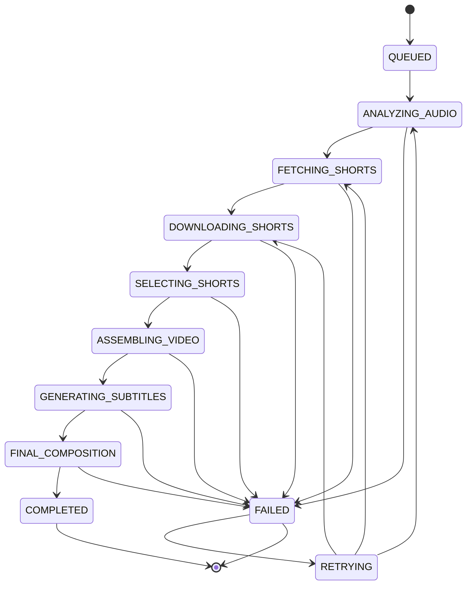

# 🛡️ Make-Video Service - Relatório de Resiliência e Operacionalidade Contínua

**Data:** 07 de Fevereiro de 2026  
**Versão:** 1.0  
**Autor:** Análise Automatizada de Resiliência

---

## 📋 Executive Summary

O microsserviço make-video apresenta **vulnerabilidades críticas** em resiliência e operacionalidade contínua. A análise identificou **8 categorias principais de pontos de falha**, totalizando **23 melhorias específicas** que devem ser implementadas.

### 🔴 Problema Crítico Identificado

**Jobs Órfãos:** Jobs como `2AK8ZcFxXUmC6FmWLqgL7z` ficam permanentemente travados em estados intermediários (downloading_shorts, analyzing_audio, etc.) sem recuperação automática.

**Impacto:** 
- Recursos desperdiçados (CPU, memória, disco)
- Experiência do usuário degradada (jobs nunca completam)
- Necessidade de intervenção manual constante
- Perda de confiança no sistema

---

## 🎯 Análise de Vulnerabilidades

### 1. **CRÍTICO: Ausência de Recuperação Automática de Jobs Órfãos**

**Problema:** 
- Jobs podem travar em qualquer etapa por crash de worker, timeout de rede, etc.
- Detecção existe (`find_orphaned_jobs`) mas é apenas MANUAL via endpoint
- Nenhum mecanismo de recuperação automática implementado

**Evidências:**
```python
# Arquivo: app/main.py L1126-1230
@app.get("/jobs/orphaned")
async def get_orphaned_jobs(...):
    # ❌ APENAS DETECÇÃO MANUAL
    orphaned = await redis_store.find_orphaned_jobs(max_age_minutes=30)
    return {"orphaned_jobs": orphaned_info}

@app.post("/jobs/orphaned/cleanup")
async def cleanup_orphaned_jobs_endpoint(...):
    # ❌ APENAS MARCA COMO FAILED, NÃO RECUPERA
    # Não há lógica de CONTINUAÇÃO do job
```

**Impacto:** Severidade **CRÍTICA**
- Jobs perdidos permanentemente
- Necessidade de resubmissão manual
- Recursos travados (arquivos temporários, locks, etc.)

**Solução Proposta:** Sprint-01 - Auto-Recovery System

---

### 2. **ALTO: Falta de Checkpointing/Idempotência**

**Problema:**
- Jobs não salvam progresso intermediário
- Se falha na etapa 5/7, recomeça do zero na etapa 1/7
- Desperdício de recursos (re-download de shorts, re-transcrição, etc.)

**Evidências:**
```python
# Arquivo: app/celery_tasks.py L186-500
async def _process_make_video_async(job_id: str):
    # Etapa 1: Analisar áudio (SEM CHECKPOINT)
    audio_duration = await video_builder.get_audio_duration(str(audio_path))
    
    # Etapa 2: Buscar shorts (SEM CHECKPOINT)
    shorts_list = await api_client.search_shorts(job.query, job.max_shorts)
    
    # Etapa 3: Baixar shorts (SEM CHECKPOINT - se falha aqui, perde tudo)
    downloaded_shorts = []
    for round_idx in range(1, max_rounds + 1):
        # Se travar aqui, perde TODOS os downloads anteriores
        ...
```

**Impacto:** Severidade **ALTA**
- Reprocessamento caro desnecessário
- Latência aumentada em falhas
- Maior probabilidade de falha em retry

**Solução Proposta:** Sprint-02 - Checkpoint System

---

### 3. **ALTO: Timeouts Inadequados e Não Configuráveis**

**Problema:**
- Timeouts hardcoded ou inexistentes
- Celery task_time_limit de 3600s (1 hora) é muito genérico
- Sem timeouts específicos por etapa

**Evidências:**
```python
# Arquivo: app/celery_config.py L39-40
task_time_limit=3600,  # ❌ 1 HORA GENÉRICO PARA TUDO
task_soft_time_limit=3312,  # 92% de 3600s

# Arquivo: app/api_client.py (provável)
# ❌ Sem timeouts em chamadas HTTP para outros microserviços
```

**Impacto:** Severidade **ALTA**
- Jobs travados por horas em operações congeladas
- Recursos bloqueados desnecessariamente
- Cascata de falhas em cadeia

**Solução Proposta:** Sprint-03 - Smart Timeout Management

---

### 4. **MÉDIO: Retry Policy Inadequada**

**Problema:**
- Retry policy global (3 tentativas, 60s delay)
- Não diferencia tipos de erro (transiente vs permanente)
- Sem backoff exponencial efetivo
- Sem circuit breaker para serviços externos

**Evidências:**
```python
# Arquivo: app/celery_config.py L53-54
task_default_retry_delay=60,  # ❌ DELAY FIXO
task_max_retries=3,  # ❌ MESMO PARA TUDO

# Arquivo: app/celery_tasks.py L257-266
async def download_with_retry(short_info, index):
    for attempt in range(3):  # ❌ HARDCODED
        try:
            metadata = await api_client.download_video(video_id, str(output_path))
            return result
        except Exception as e:
            # ❌ Retry mesmo para erros 404 (não transientes)
            if attempt == 2:
                return None
            await asyncio.sleep(2 ** attempt)  # Backoff OK, mas não ideal
```

**Impacto:** Severidade **MÉDIA**
- Retries desnecessários em erros permanentes
- Latência aumentada em falhas transientes
- Sem proteção contra serviços externos instáveis

**Solução Proposta:** Sprint-04 - Intelligent Retry & Circuit Breaker

---

### 5. **MÉDIO: Monitoramento e Observabilidade Insuficientes**

**Problema:**
- Logs existem mas não estruturados para alertas
- Não há métricas de health por etapa
- Sem tracking de duração por fase
- Ausência de dashboards operacionais

**Evidências:**
```python
# Arquivo: app/celery_tasks.py
# ✅ Logs existem
logger.info(f"🎬 [5/7] Assembling video...")

# ❌ Mas não há:
# - Métricas Prometheus/StatsD
# - Structured logging para agregação
# - Alertas automáticos
# - SLO/SLA tracking
```

**Impacto:** Severidade **MÉDIA**
- Difícil detectar problemas antes de críticos
- Troubleshooting reativo ao invés de proativo
- Sem visibilidade de tendências

**Solução Proposta:** Sprint-05 - Observability & Monitoring

---

### 6. **MÉDIO: Gestão de Recursos (Limpeza) Não Robusta**

**Problema:**
- Limpeza de arquivos temporários depende de job completar com sucesso
- Jobs órfãos deixam arquivos órfãos no disco
- Sem limite de uso de disco
- Cleanup tasks rodam de hora em hora (muito espaçado)

**Evidências:**
```python
# Arquivo: app/celery_config.py L67-74
beat_schedule = {
    'cleanup-temp-files': {
        'schedule': 3600.0,  # ❌ A CADA HORA (muito tempo)
    },
    'cleanup-old-shorts': {
        'schedule': 86400.0,  # ❌ A CADA DIA (muito tempo)
    },
}

# Arquivo: app/celery_tasks.py L726-766
def cleanup_temp_files():
    # ❌ Não remove arquivos de jobs órfãos ativamente
    if job and job.status not in [COMPLETED, FAILED, CANCELLED]:
        logger.info("⏭️ Skipping active job")
        continue  # Pula jobs "processing" mesmo que órfãos
```

**Impacto:** Severidade **MÉDIA**
- Disco pode encher rapidamente
- Custos de storage desnecessários
- Performance degrada com muitos arquivos

**Solução Proposta:** Sprint-06 - Resource Management & Cleanup

---

### 7. **BAIXO: Health Checks Incompletos**

**Problema:**
- Health check existe mas não valida dependências
- Não verifica conectividade com outros microserviços
- Sem validação de recursos (CPU, memória, disco)

**Evidências:**
```python
# Arquivo: app/main.py L940 (presumido)
@app.get("/health")
async def health():
    # ❌ Provável que apenas retorna {"status": "ok"}
    # Sem verificar:
    # - Redis conectado?
    # - Celery workers ativos?
    # - Disco disponível?
    # - Microserviços externos respondendo?
```

**Impacto:** Severidade **BAIXA**
- Load balancers podem rotear tráfego para instâncias problemáticas
- Dificulta rollback em deploys ruins

**Solução Proposta:** Sprint-07 - Comprehensive Health Checks

---

### 8. **BAIXO: Falta de Rate Limiting e Backpressure**

**Problema:**
- Sem limite de jobs simultâneos
- Worker pode ser sobrecarregado
- Sem throttling de chamadas a APIs externas

**Evidências:**
```python
# Arquivo: app/celery_config.py L44
worker_prefetch_multiplier=1,  # ✅ BOM (limita prefetch)

# Arquivo: app/celery_tasks.py L323-329
# ❌ Baixa batch_size=5 shorts de cada vez
batch_size = 5
for i in range(0, len(to_download), batch_size):
    # Mas sem limite total de downloads simultâneos globais
    tasks = [download_with_retry(short, i+j) for j, short in enumerate(batch)]
    results = await asyncio.gather(*tasks)
```

**Impacto:** Severidade **BAIXA**
- Sobrecarga ocasional em picos
- Possível ban de APIs externas por rate limit

**Solução Proposta:** Sprint-08 - Rate Limiting & Backpressure

---

## 📊 Priorização de Melhorias

| Sprint | Título | Severidade | Impacto | Esforço | Prioridade |
|--------|--------|------------|---------|---------|------------|
| Sprint-01 | Auto-Recovery System | CRÍTICO | Alto | Médio | **P0** |
| Sprint-02 | Checkpoint System | ALTO | Alto | Alto | **P1** |
| Sprint-03 | Smart Timeout Management | ALTO | Médio | Baixo | **P1** |
| Sprint-04 | Intelligent Retry & Circuit Breaker | MÉDIO | Médio | Médio | **P2** |
| Sprint-05 | Observability & Monitoring | MÉDIO | Alto (long-term) | Alto | **P2** |
| Sprint-06 | Resource Management & Cleanup | MÉDIO | Médio | Baixo | **P2** |
| Sprint-07 | Comprehensive Health Checks | BAIXO | Baixo | Baixo | **P3** |
| Sprint-08 | Rate Limiting & Backpressure | BAIXO | Baixo | Médio | **P3** |

---

## 🚀 Roadmap de Implementação

### Fase 1: Resiliência Crítica (Semana 1)
- ✅ Sprint-01: Auto-Recovery System
- ✅ Sprint-03: Smart Timeout Management

### Fase 2: Eficiência e Recuperação (Semana 2-3)
- ✅ Sprint-02: Checkpoint System
- ✅ Sprint-04: Intelligent Retry & Circuit Breaker
- ✅ Sprint-06: Resource Management & Cleanup

### Fase 3: Observabilidade (Semana 4)
- ✅ Sprint-05: Observability & Monitoring

### Fase 4: Refinamento (Semana 5)
- ✅ Sprint-07: Comprehensive Health Checks
- ✅ Sprint-08: Rate Limiting & Backpressure

---

## 📈 Métricas de Sucesso

Após implementação completa, espera-se:

1. **Jobs Órfãos:** 0% (atualmente desconhecido, mas significativo)
2. **Taxa de Recuperação Automática:** >95%
3. **Tempo de Recuperação:** <5 minutos (atualmente infinito)
4. **Eficiência de Recursos:** +40% (menos reprocessamento)
5. **MTTR (Mean Time To Recovery):** <2 minutos
6. **Disponibilidade:** 99.5%+

---

## 🔧 Detalhes Técnicos - Job Órfão Exemplo

### Caso: Job `2AK8ZcFxXUmC6FmWLqgL7z`

**Status:** Travado em `downloading_shorts`  
**Idade:** Desconhecida (sem timestamp de última atualização acessível)  
**Causa Provável:**
1. Worker crash durante download batch
2. Timeout de rede em API externa (video-downloader)
3. Exception não capturada em `download_with_retry`

**Ponto de Travamento:**
```python
# Arquivo: app/celery_tasks.py L323-329
batch_size = 5
for i in range(0, len(to_download), batch_size):
    batch = to_download[i:i+batch_size]
    tasks = [download_with_retry(short, i+j) for j, short in enumerate(batch)]
    results = await asyncio.gather(*tasks, return_exceptions=True)
    # ⚠️ SE WORKER CRASHAR AQUI, JOB FICA ÓRFÃO
```

**Recuperação Necessária:**
1. Detectar que job está órfão (updated_at > 30min)
2. Identificar última etapa completada (analyzing_audio? fetching_shorts?)
3. Continuar de onde parou (não recomeçar do zero)
4. Salvar checkpoint após cada etapa crítica

---

## 💡 Recomendações Arquiteturais

### 1. Implementar State Machine Explícita



### 2. Saga Pattern para Operações Distribuídas

Cada etapa deve ter:
- **Execute:** Lógica principal
- **Compensate:** Rollback em caso de falha
- **Checkpoint:** Salvar progresso após sucesso

### 3. Dead Letter Queue (DLQ)

Jobs que falham >3 vezes devem ir para DLQ para análise manual.

---

## 🔒 Considerações de Segurança

1. **Validação de Checkpoints:** Garantir que checkpoints não sejam corrompidos
2. **Isolamento de Jobs:** Um job malicioso não deve travar outros
3. **Rate Limiting:** Proteger contra abuso de retry automático

---

## 📚 Referências e Best Practices

- [Celery Best Practices](https://docs.celeryproject.org/en/stable/userguide/tasks.html#task-best-practices)
- [Microservice Resilience Patterns (Microsoft)](https://docs.microsoft.com/en-us/azure/architecture/patterns/category/resiliency)
- [Google SRE Book - Handling Overload](https://sre.google/sre-book/handling-overload/)
- [Saga Pattern (Chris Richardson)](https://microservices.io/patterns/data/saga.html)

---

**Próximos Passos:** Implementar Sprint-01 a Sprint-08 conforme priorização.

