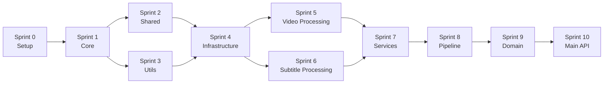

# 🎯 GUIA DE SPRINTS - PYTEST MAKE-VIDEO SERVICE

**Documentação Executiva para Desenvolvimento de Testes**

---

## 📚 ÍNDICE DE SPRINTS

| Sprint | Arquivo | Módulo | Prioridade | Duração | Status |
|--------|---------|--------|------------|---------|--------|
| 0 | [SPRINT-00-SETUP.md](SPRINT-00-SETUP.md) | Configuração | 🔴 CRÍTICA | 2-3h | ⏳ Pendente |
| 1 | [SPRINT-01-CORE.md](SPRINT-01-CORE.md) | core/ | 🔴 CRÍTICA | 3-4h | ⏳ Pendente |
| 2 | [SPRINT-02-SHARED.md](SPRINT-02-SHARED.md) | shared/ | 🟡 ALTA | 2-3h | ⏳ Pendente |
| 3 | [SPRINT-03-UTILS.md](SPRINT-03-UTILS.md) | utils/ | 🟡 ALTA | 3-4h | ⏳ Pendente |
| 4 | [SPRINT-04-INFRASTRUCTURE.md](SPRINT-04-INFRASTRUCTURE.md) | infrastructure/ | 🔴 CRÍTICA | 4-5h | ⏳ Pendente |
| 5 | [SPRINT-05-VIDEO-PROCESSING.md](SPRINT-05-VIDEO-PROCESSING.md) | video_processing/ | 🔴 CRÍTICA | 6-8h | ⏳ Pendente |
| 6 | [SPRINT-06-SUBTITLE-PROCESSING.md](SPRINT-06-SUBTITLE-PROCESSING.md) | subtitle_processing/ | 🟡 ALTA | 4-5h | ⏳ Pendente |
| 7 | [SPRINT-07-SERVICES.md](SPRINT-07-SERVICES.md) | services/ | 🟡 ALTA | 4-5h | ⏳ Pendente |
| 8 | [SPRINT-08-PIPELINE.md](SPRINT-08-PIPELINE.md) | pipeline/ | 🔴 CRÍTICA | 5-6h | ⏳ Pendente |
| 9 | [SPRINT-09-DOMAIN.md](SPRINT-09-DOMAIN.md) | domain/ | 🟡 ALTA | 5-6h | ⏳ Pendente |
| 10 | [SPRINT-10-MAIN-API.md](SPRINT-10-MAIN-API.md) | main + api/ | 🔴 CRÍTICA | 3-4h | ⏳ Pendente |

**Duração Total Estimada**: 42-53 horas (~5-7 dias de trabalho)

---

## 🚀 COMO USAR ESTE GUIA

### Sequência de Execução



### Ordem Recomendada

1. **Obrigatório**: Sprint 0 (Setup) - Deve ser executada primeiro
2. **Sequencial**: Sprints 1-3 (base)
3. **Paralelo**: Sprints 4-7 (podem ser feitas em paralelo após Sprint 3)
4. **Sequencial**: Sprints 8-10 (integração e validação final)

---

## 📋 ESTRUTURA DE CADA SPRINT

Cada arquivo de sprint contém:

### 1. 📄 Cabeçalho
- Nome da sprint
- Prioridade
- Duração estimada
- Status

### 2. 🎯 Objetivos
- O que será testado
- Por que é importante
- Relação com o bug em produção

### 3. 📁 Arquivos no Escopo
- Lista completa de arquivos
- Linha de código
- Responsabilidade de cada arquivo

### 4. 🔍 Análise de Dependências
- Dependências internas
- Dependências externas
- Pré-requisitos

### 5. 🧪 Casos de Teste
- Código completo dos testes
- Explicação de cada teste
- Assertions esperadas

### 6. 📦 Fixtures e Setup
- Fixtures necessárias
- Setup específico
- Teardown

### 7. 🛠️ Implementação Passo a Passo
- Checklist detalhado
- Comandos exatos
- Ordem de execução

### 8. ✅ Critérios de Aceitação
- Condições para passar
- Métricas de sucesso
- Cobertura mínima

### 9. 🐛 Troubleshooting
- Problemas comuns
- Soluções
- Links úteis

### 10. 📊 Validação
- Como validar
- Comandos de verificação
- Output esperado

---

## 🎓 BOAS PRÁTICAS

### Antes de Começar uma Sprint

- [ ] Ler a sprint completa antes de começar
- [ ] Verificar dependências anteriores cumpridas
- [ ] Preparar ambiente (Redis, FFmpeg, etc.)
- [ ] Criar branch específica (ex: `test/sprint-01-core`)
- [ ] Revisar arquivos do escopo

### Durante a Sprint

- [ ] Implementar testes um de cada vez
- [ ] Executar teste imediatamente após escrever
- [ ] Corrigir falhas antes de continuar
- [ ] Fazer commits pequenos e frequentes
- [ ] Documentar problemas encontrados

### Após a Sprint

- [ ] Executar todos os testes da sprint
- [ ] Verificar cobertura
- [ ] Atualizar status no README
- [ ] Commit final com mensagem descritiva
- [ ] Tag da sprint (ex: `sprint-01-complete`)
- [ ] Atualizar documentação se necessário

---

## 🎯 ESTRATÉGIA DE TESTES REAIS

### Princípios Fundamentais

✅ **SEMPRE USAR**:
- Arquivos reais (vídeos, áudios, imagens)
- Diretórios temporários reais (`tmp_path`)
- Redis real (database de teste)
- SQLite real (arquivos temporários)
- FFmpeg real (operações completas)
- Dados reais (não sintéticos)

❌ **NUNCA USAR**:
- Mocks de filesystem
- Mocks de Redis/databases
- Mocks de FFmpeg
- Dados falsos/hardcoded
- Stubs de operações críticas

### Como Gerar Dados de Teste Reais

```python
# Vídeo de teste (10 segundos, 1080x1920)
subprocess.run([
    "ffmpeg", "-f", "lavfi", "-i", "testsrc=duration=10:size=1080x1920:rate=30",
    "-vf", "drawtext=text='TEST':fontsize=48:fontcolor=white:x=(w-text_w)/2:y=(h-text_h)/2",
    "-c:v", "libx264", "-pix_fmt", "yuv420p", "test_video.mp4"
], check=True)

# Áudio de teste (5 segundos, tom de 440Hz)
subprocess.run([
    "ffmpeg", "-f", "lavfi", "-i", "sine=frequency=440:duration=5",
    "-c:a", "libmp3lame", "test_audio.mp3"
], check=True)

# Vídeo com legendas
subprocess.run([
    "ffmpeg", "-f", "lavfi", "-i", "color=c=black:s=1080x1920:d=5",
    "-vf", "drawtext=text='SUBTITLE':fontsize=48:fontcolor=white:x=(w-text_w)/2:y=h-100",
    "-c:v", "libx264", "video_with_subs.mp4"
], check=True)
```

---

## 📊 MÉTRICAS E ACOMPANHAMENTO

### Dashboard de Progresso

Atualize após cada sprint:

```markdown
## Status das Sprints

- [x] Sprint 0: Setup ✅ (2024-02-19)
- [ ] Sprint 1: Core ⏳
- [ ] Sprint 2: Shared ⏳
- [ ] Sprint 3: Utils ⏳
- [ ] Sprint 4: Infrastructure ⏳
- [ ] Sprint 5: Video Processing ⏳
- [ ] Sprint 6: Subtitle Processing ⏳
- [ ] Sprint 7: Services ⏳
- [ ] Sprint 8: Pipeline ⏳
- [ ] Sprint 9: Domain ⏳
- [ ] Sprint 10: Main API ⏳

**Progresso**: 1/11 (9%)
**Cobertura Atual**: X%
**Bugs Encontrados**: N
**Bugs Corrigidos**: M
```

### Template de Relatório de Sprint

Ao finalizar cada sprint, crie um `SPRINT-0X-REPORT.md`:

```markdown
# Relatório Sprint 0X - [NOME]

**Data**: YYYY-MM-DD
**Desenvolvedor**: [Nome]
**Duração Real**: Xh

## Resultados

- ✅ Testes implementados: N
- ✅ Testes passando: M
- ❌ Testes falhando: K
- 📊 Cobertura alcançada: X%

## Problemas Encontrados

1. **Problema 1**: Descrição
   - **Solução**: Como foi resolvido

## Aprendizados

- Aprendizado 1
- Aprendizado 2

## Próximos Passos

- [ ] Item 1
- [ ] Item 2
```

---

## 🔧 FERRAMENTAS ÚTEIS

### Comandos Rápidos

```bash
# Executar sprint específica
pytest tests/unit/core/ -v  # Sprint 1

# Com cobertura
pytest tests/unit/core/ --cov=app.core --cov-report=term

# Apenas testes que falharam
pytest --lf -v

# Parar no primeiro erro
pytest -x -v

# Verbose com stdout
pytest -v -s

# Marcar sprint como completa
git tag sprint-01-complete
git push --tags
```

### Verificações de Saúde

```bash
# Redis funcionando?
redis-cli ping

# FFmpeg instalado?
ffmpeg -version

# Python correto?
python --version

# Dependências instaladas?
pip list | grep pytest

# Estrutura de testes OK?
pytest --collect-only
```

---

## 🆘 SUPORTE E AJUDA

### Quando Pedir Ajuda

- Teste falhando após 30min de debug
- Erro não documentado no troubleshooting
- Incerteza sobre implementação
- Cobertura não atingida após múltiplas tentativas

### Onde Buscar Ajuda

1. **Documentação da Sprint**: Seção troubleshooting
2. **Documentação do Projeto**: docs/
3. **Issues do GitHub**: Issues similares
4. **Stack Overflow**: Erros específicos
5. **Time/Mentor**: Para decisões arquiteturais

---

## 📖 DOCUMENTAÇÃO RELACIONADA

- [PYTEST_SPRINT_PLANNING.md](../PYTEST_SPRINT_PLANNING.md) - Planejamento completo
- [README.md](../README.md) - Visão geral do serviço
- [IMPLEMENTATION_SUMMARY.md](../IMPLEMENTATION_SUMMARY.md) - Resumo de implementação
- [pytest.ini](../pytest.ini) - Configuração do pytest
- [conftest.py](../tests/conftest.py) - Fixtures globais

---

## 🎉 CHECKLIST FINAL (Após todas as sprints)

- [ ] Todas as 11 sprints completas
- [ ] Cobertura global > 85%
- [ ] Bug de produção resolvido
- [ ] CRON job testado e funcional
- [ ] Pipeline end-to-end validado
- [ ] Documentação atualizada
- [ ] Code review realizado
- [ ] CI/CD atualizado
- [ ] Deploy em staging validado
- [ ] Deploy em produção agendado

---

**Versão**: 1.0.0  
**Última Atualização**: 2026-02-19  
**Autor**: GitHub Copilot  
**Status**: 📖 PRONTO PARA USO
