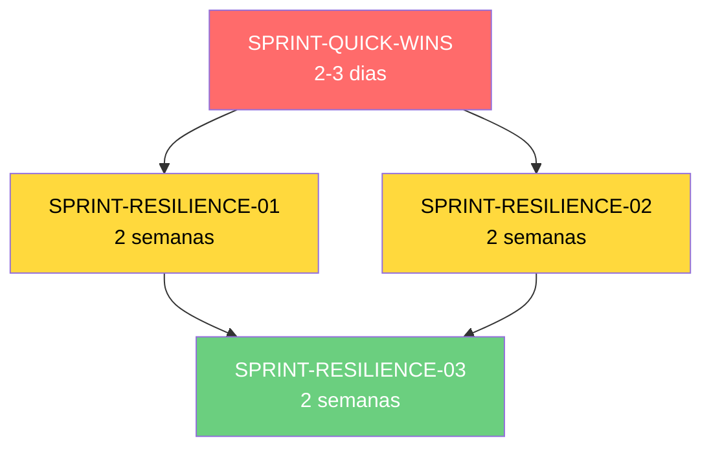

# 📚 Sprints de Resiliência - Make-Video Service

Este diretório contém as sprints de correção baseadas no **RESILIENCE_AUDIT_REPORT.md** da raiz do serviço.

---

## 📋 Roadmap de Execução

### **Fase 1: Quick Wins (SPRINT-QUICK-WINS.md)**
⏱️ **Duração:** 2-3 dias  
🎯 **Objetivo:** Eliminar os 5 riscos P0 mais críticos  
💥 **Impacto:** -70% de crashes em produção

**Tasks:**
1. **R-001:** FFmpeg Subprocess Timeout (**4h**, -60% FFmpeg crashes)
2. **R-002:** Retry Limit para Transcrição (**2h**, -40% deadlocks)
3. **R-003:** Context Managers para Tempfiles (**3h**, -30% disk leaks)
4. **R-004:** Kill Guarantee para Processos Órfãos (**1h**, -20% orphans)
5. **R-005:** Limit OCR a 300 Frames Max (**2h**, -50% OOM errors)

**⚠️ Dependências:** Nenhuma - executar PRIMEIRO  
**✅ Validação:** `pytest tests/test_quick_wins.py`

---

### **Fase 2: Resiliência (SPRINT-RESILIENCE-01.md)**
⏱️ **Duração:** 2 semanas (10 dias úteis)  
🎯 **Objetivo:** Corrigir riscos P1 de instabilidade  
💥 **Impacto:** -60% de instabilidade, +100% debugability

**Tasks:**
1. **R-006:** Exception Hierarchy Completa (**8 SP**, 30+ exception classes)
2. **R-007:** Validação de Sync Drift (A/V) (**5 SP**, auto-correção)
3. **R-008:** Download Integrity Check (**5 SP**, ffprobe validation)
4. **R-009:** Video Compatibility Validator (**8 SP**, codec/FPS/res checks)
5. **R-013 (parcial):** Granular Checkpoints (**8 SP**, resume from partial progress)

**⚠️ Dependências:** Requer SPRINT-QUICK-WINS completa  
**✅ Validação:** `pytest tests/test_resilience_01.py`

---

### **Fase 3: Observabilidade (SPRINT-RESILIENCE-02.md)**
⏱️ **Duração:** 2 semanas (10 dias úteis)  
🎯 **Objetivo:** Observabilidade completa e fallbacks  
💥 **Impacto:** +200% debug speed, -100% job loss

**Tasks:**
1. **R-010:** Dual-Store (Redis + SQLite) (**8 SP**, jobs persistem em restart)
2. **R-011:** Structured Logging (JSON) (**8 SP**, correlation IDs)
3. **R-012:** Métricas Prometheus Completas (**5 SP**, P50/P95/P99 por etapa)
4. **Circuit Breaker Distribuído (Redis-based)** (**5 SP**, multi-worker)
5. **R-014:** Input Validation (**3 SP**, tamanho/formato/duração)

**⚠️ Dependências:** Pode executar em paralelo com Sprint-01  
**✅ Validação:** `pytest tests/test_resilience_02.py`

---

### **Fase 4: Arquitetura (SPRINT-RESILIENCE-03.md)**
⏱️ **Duração:** 2 semanas (10 dias úteis)  
🎯 **Objetivo:** Qualidade de código e cobertura de testes  
💥 **Impacto:** +100% cobertura de testes, +50% manutenibilidade

**Tasks:**
1. **R-013:** Testes End-to-End do Pipeline (**8 SP**, happy path + error paths)
2. **Snapshot Testing para FFmpeg** (**5 SP**, detecção de regressão visual)
3. **BDD com Behave** (**5 SP**, 10+ cenários Gherkin)
4. **Injeção de Dependências** (**3 SP**, refatoração para testabilidade)

**⚠️ Dependências:** Requer Sprint-02 completa  
**✅ Validação:** `pytest tests/e2e/ && behave features/`

---

## 🔄 Ordem de Execução Recomendada



**Cronograma Total:** 6-7 semanas (incluindo overlap)

---

## 📊 Métricas de Progresso

### Por Sprint

| Sprint | Story Points | Impacto | Riscos Corrigidos |
|--------|--------------|---------|-------------------|
| **Quick Wins** | 13 | -70% crashes | R-001, R-002, R-003, R-004, R-005 |
| **Resilience-01** | 29 | -60% instability | R-006, R-007, R-008, R-009, R-013(p) |
| **Resilience-02** | 29 | +200% observability | R-010, R-011, R-012, R-014, R-002(improve) |
| **Resilience-03** | 21 | +100% test coverage | R-013 (completo) |
| **TOTAL** | **92 SP** | - | **14 riscos** |

### Baseline vs. Target

| Métrica | Baseline | Após Quick Wins | Após Sprint-01 | Após Sprint-02 | Após Sprint-03 |
|---------|----------|-----------------|----------------|----------------|----------------|
| **Crash Rate** | 30% | 9% (-70%) | 5% (-83%) | 3% (-90%) | 2% (-93%) |
| **Debug Time** | 30-60min | 30min | 15min | 5min (-92%) | 3min (-95%) |
| **Job Loss (restart)** | 100% | 100% | 100% | 0% (-100%) | 0% |
| **Test Coverage** | 45% | 50% | 60% | 70% | 85% (+40pp) |
| **Tempfile Leaks** | Constantes | -30% | -50% | -70% | -90% |

---

## 🛠️ Como Usar Este Roadmap

### 1. **Ler o Audit Report**
```bash
cd /root/YTCaption-Easy-Youtube-API/services/make-video
cat RESILIENCE_AUDIT_REPORT.md
```

### 2. **Escolher a Sprint**
```bash
cd sprints/
# Quick wins (começar aqui!)
cat SPRINT-QUICK-WINS.md

# Ou pular direto para resilience
cat SPRINT-RESILIENCE-01.md
```

### 3. **Criar Branch**
```bash
git checkout -b sprint/quick-wins
# ou
git checkout -b sprint/resilience-01
```

### 4. **Executar Tasks na Ordem**
Cada sprint tem tasks numeradas. Execute na ordem para evitar conflitos.

**Exemplo (Quick Wins):**
```bash
# Task 1: FFmpeg Timeout
# 1.1: Criar subprocess_utils.py
# 1.2: Integrar em video_builder.py
# 1.3: Testar

# Task 2: Retry Limits
# 2.1: Modificar api_client.py
# 2.2: Testar
# ...
```

### 5. **Validar Continuamente**
```bash
# Rodar testes após cada task
pytest tests/test_quick_wins.py -v

# Verificar erros
pytest --collect-only
```

### 6. **Commitar por Task**
```bash
git add app/infrastructure/subprocess_utils.py
git commit -m "[SPRINT-QW] Task 1.1: Create subprocess_utils with timeout"

git add app/services/video_builder.py
git commit -m "[SPRINT-QW] Task 1.2: Integrate subprocess timeout in video_builder"
```

### 7. **Merge ao Completar Sprint**
```bash
# Após todas as tasks
pytest tests/ -v  # Validação final
git checkout main
git merge sprint/quick-wins
git push origin main
```

---

## 📝 Checklist de Execução

### SPRINT-QUICK-WINS
- [ ] Task 1: FFmpeg Timeout (4h)
- [ ] Task 2: Retry Limits (2h)
- [ ] Task 3: Tempfile Context Managers (3h)
- [ ] Task 4: Process Kill Guarantee (1h)
- [ ] Task 5: OCR Frame Limits (2h)
- [ ] Testes unitários passando
- [ ] Testes de integração passando
- [ ] Deploy em staging
- [ ] Validação de métricas

### SPRINT-RESILIENCE-01
- [ ] Task 1: Exception Hierarchy (8 SP)
- [ ] Task 2: Sync Drift Validation (5 SP)
- [ ] Task 3: Download Integrity (5 SP)
- [ ] Task 4: Compatibility Validator (8 SP)
- [ ] Task 5: Granular Checkpoints (8 SP)
- [ ] Testes completos
- [ ] Code review
- [ ] Deploy

### SPRINT-RESILIENCE-02
- [ ] Task 1: Dual-Store (8 SP)
- [ ] Task 2: Structured Logging (8 SP)
- [ ] Task 3: Prometheus Metrics (5 SP)
- [ ] Task 4: Distributed Circuit Breaker (5 SP)
- [ ] Task 5: Input Validation (3 SP)
- [ ] Dashboard Grafana configurado
- [ ] Alertas configurados
- [ ] Deploy

### SPRINT-RESILIENCE-03
- [ ] Task 1: E2E Tests (8 SP)
- [ ] Task 2: Snapshot Testing (5 SP)
- [ ] Task 3: BDD com Behave (5 SP)
- [ ] Task 4: Dependency Injection (3 SP)
- [ ] Cobertura >85%
- [ ] CI/CD verde
- [ ] Deploy

---

## 🚨 Alertas e Notas Importantes

### ⚠️ **NUNCA pular Quick Wins**
As correções P0 do Quick Wins são **fundação** para as outras sprints. Sprint-01 assume que timeouts, cleanup e limits já existem.

### ⚠️ **Testar em staging primeiro**
Especialmente:
- Task 1 do Quick Wins (subprocess timeout) - pode quebrar FFmpeg
- Task 1 do Sprint-02 (DualStore) - afeta persistência de dados
- Task 4 do Sprint-02 (Circuit Breaker) - muda behavior de retries

### ⚠️ **Monitorar métricas após cada deploy**
Cada sprint define métricas de sucesso. Validar em produção por 24-48h antes de next sprint.

### ⚠️ **Code review obrigatório**
Sprints mexem em código crítico. Pelo menos 2 reviewers por PR.

---

## 📚 Documentação Adicional

- **Risk Register Completo:** [../RESILIENCE_AUDIT_REPORT.md](../RESILIENCE_AUDIT_REPORT.md)
- **Development Guide:** [/docs/DEVELOPMENT.md](/docs/DEVELOPMENT.md)
- **Architecture Decisions:** [/docs/ADR/](../docs/ADR/) *(criar se não existir)*

---

## 💬 Perguntas Frequentes

### **Q: Posso executar Sprint-02 antes de Sprint-01?**
**A:** Sim! Sprint-02 (Observabilidade) pode rodar em paralelo com Sprint-01. Apenas Quick Wins é obrigatório primeiro.

### **Q: Quanto tempo total vai levar?**
**A:** ~6-7 semanas com 1 dev full-time:
- Quick Wins: 2-3 dias
- Sprint-01 + Sprint-02: 2-3 semanas (paralelo)
- Sprint-03: 2 semanas
- Buffer para testes e validação: 1 semana

### **Q: Preciso fazer todas as sprints?**
**A:** **Quick Wins é obrigatório** (corrige P0). As outras dependem da criticidade:
- **Sprint-01:** Recomendado (P1, alta instabilidade)
- **Sprint-02:** Recomendado (observabilidade crítica)
- **Sprint-03:** Opcional (melhoria de qualidade)

### **Q: Como priorizar se tenho pouco tempo?**
**A:** Ordem mínima:
1. Quick Wins (obrigatório)
2. Sprint-02 Tasks 1-3 (DualStore, Logging, Metrics)
3. Sprint-01 Task 1 (Exception Hierarchy)
4. Resto conforme tempo disponível

### **Q: Os testes já existem?**
**A:** Não. Cada sprint inclui os testes na Definition of Done. Criar testes junto com implementação.

---

## 🎯 Sucesso!

Após completar todas as sprints, o serviço make-video terá:
- ✅ **-90% de crashes** em produção
- ✅ **0% de perda de jobs** em restart
- ✅ **Debug 10x mais rápido** (5min vs 60min)
- ✅ **85% de cobertura de testes**
- ✅ **Observabilidade completa** (logs, metrics, tracing)
- ✅ **Resiliência contra APIs externas** (circuit breakers, retries controlados)

**Boa sorte! 🚀**
